# Appendix: Overview of Microsoft Identity Security Monitoring

_Author: Thomas Naunheim_

_Created: December 2020, Updated October 2022_

*Microsoft offers several solutions and services for securing (hybrid) identities and protecting access to workloads such as Azure, Office 365 or other integrated apps in Azure Active Directory. I like to give a detailed overview about data sources or signals that should be considered for monitoring based on identity-related activities, risk detections, alerts and events across the Microsoft ecosystem.*

#### Table of Content:
- <A href="#identity-security-monitoring-in-a-hybrid-environment">Identity Security Monitoring in a "Hybrid Environment"</A> 
- <A href="#azure-monitor-operational-logs-and-alerts-of-azure-ad-and-azure-workloads"><b>Azure Monitor:</b>
Operational Logs and Alerts of "Azure AD" and "Azure Workloads"</A> 

- <A href="#mda-and-defender-for-identity-unified-secops-of-connected-cloud-apps-and-hybrid-identity"><b>Microsoft Defender for Cloud Apps:</b>
Unified SecOps of connected "Cloud Apps" and "Hybrid Identity"</A> 
- <A href="#microsoft-365-defender-unified-secops-of-m365-services"><b>Microsoft 365 Defender:</b>
Unified SecOps of M365 Services</A> 
- <A href="#microsoft-sentinel-single-pane-of-glass-across-azure-microsoft-365-and-3rd-party-cloud-platforms"><b>Microsoft Sentinel:</b>"Single pane of glass" across Azure, M365 and "3rd party solutions"</A>

## Identity Security Monitoring in a Hybrid Environment

In the recent year, I‘ve talked about monitoring of Azure Active Directory in community sessions and talks. From my point of view a comprehensive monitoring of identity security events must be an essential part of deployment plans and daily operations. Even though it may seem obvious as "best practice" ("[Actively monitor for suspicious activities](https://docs.microsoft.com/en-us/azure/security/fundamentals/identity-management-best-practices?WT.mc_id=AZ-MVP-5003945#actively-monitor-for-suspicious-activities)"), it is sometimes underrated.

Monitoring across "Azure AD" and "Active Directory" (including spreading between workloads in Azure and on-premises environments) can be complex and sometimes challenging but more important then ever. Identity protection in a "hybrid world" means also to protect and monitor Active Directory environments with all existing risks and traditional attack methods (e.g. "Pass-the-Hash"). The weakest link and uncover attack surfaces in your on-premises environment can be used to leverage or extend attacks to (hybrid) cloud services.

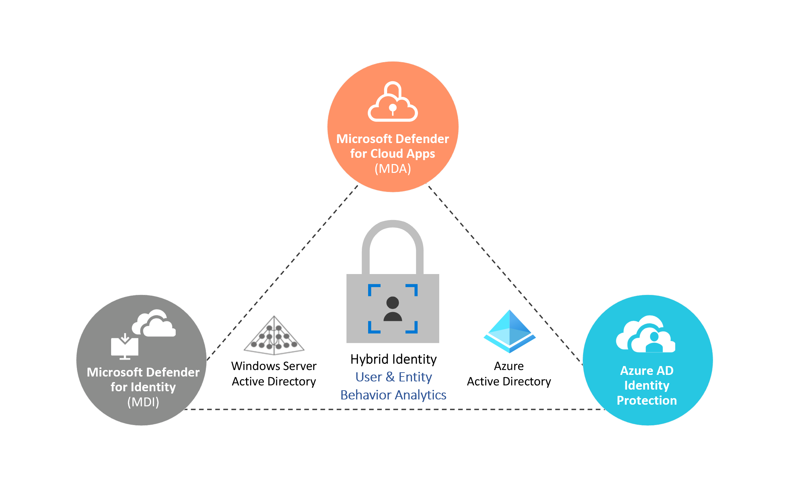
_"Microsoft Defender for Identity" (MDI), "Microsoft Defender for Cloud Apps" (MDA) and "Azure AD Identity Protection" (IPC) protects identities on various levels and platforms (On-Premises, Session/Cloud Apps and Cloud Identity/Sign-ins)_ 

Implementing "identity security" does not end with "enabling" those features or by following the recommendations by "[Identity Secure Score](https://docs.microsoft.com/en-us/azure/active-directory/fundamentals/identity-secure-score?WT.mc_id=AZ-MVP-5003945)".

It’s important to develop a "continuous improvement" strategy of detections and "operational guide" to empower and monitor your signals of "guards". This includes also to provide workflows for automated response, an "unified view" for incident management/hunting, security processes and posture management. In addition, Microsoft products are being continuously improved and also changes in integration and connection between the products needs to be considered.

Extensive possibilities of "User and Entity Behavior Analytics" (UEBA) allows SecOps to find anomalous activities (calculated by machine learning algorithms) across the various data sources or signals instead of building a manual correlation.

As always, keep up-to-date and notified about latest changes of security features, attack/defense scenarios or security recommendations. Verification of effectiveness by "simulated attacks" should be also part of your operational tasks.

### Changes of product names and portals
*Note: Microsoft announced many product name changes at the Ignite 2020 and Ignite 2021. I've used all new product names in this article.
A good overview of all name changes are included [in this blog post by Microsoft](https://techcommunity.microsoft.com/t5/itops-talk-blog/microsoft-365-and-azure-security-product-name-changes/ba-p/1719167?WT.mc_id=M365-MVP-5003945).*

In addition, the Microsoft 365 Defender (M365D) Portal has been become the unified portal for all M365 products:

| Previous product name             | New product name                        | Previous portal URL | New portal URL | Migration to Unified M365 Security Portal |
| ----------------------            | ----------------                        | ------------------- | -------------- | ----------------------------------------- |
|Azure ATP (AATP)                   | Microsoft Defender for Identity (MDI)   | https://TenantName.atp.azure.com  | https://security.microsoft.com  | Alerts and Configuration in M365D Security Portal (Redirect to new portal can be configured)
|Azure Security Center (ASC)        | Microsoft Defender for Cloud (MDC)      | https://portal.azure.com          | https://portal.azure.com  | No integration planned
|Azure Sentinel                     | Microsoft Sentinel                      | https://portal.azure.com          | https://portal.azure.com  | No integration planned
|Azure Defender                     | Microsoft Defender for Cloud (MDC)      | https://portal.azure.com          | https://portal.azure.com  | No integration planned
|Microsoft Cloud App Security (MCAS)| Microsoft Defender for Cloud Apps (MDA)| https://TenantName.portal.cloudappsecurity.com  | https://security.microsoft.com  | Alerts and Configuration in M365D Portal (security.microsoft.com)
|Microsoft Defender ATP (MDATP)     | Microsoft Defender for Endpoint (MDE)   | https://securitycenter.windows.com/ | https://security.microsoft.com  | Alerts and Configuration in M365D Portal (Redirect to new portal can be configured)
|Office ATP (OATP)                  | Microsoft Defender for Office (MDO)   | https://protection.office.com/  | https://security.microsoft.com  | Incidents and Configuration in M365D Portal (Redirect to new portal can be configured)

### Scope of documentation and side notes
This article is an attempt to give a detailed overview on solutions to collect identity-related security events and implement auto-response on threads or risks. Many links to detailed documentation by Microsoft and members of the community are included.
There is no claim for completeness and comprehensive view of all options.
I've tried to find some "sample use cases" to underline when this monitoring option will be in particularly relevance.
It was hard for me to find the right level of details or scope with regard to the wide-range of this topic.

*The following objectives are excluded and out of scope:
Azure AD B2C, Azure AD Domain Services and Microsoft Information Protection (AIP/MIP) will not be described in this blog post.*

_Caution: All description of features, potential limitations and implementation considerations are based on personal experiences and research results at the time of writing this article. Therefore the content and statement can be outdated since the article was published._

_Tip: The following visualization are showing flows of incident/alert and raw log data but also integration between different Microsoft Security products. Therefore I've used different lines and colors which makes it easier to identify_

_Tip: Verify and evaluate your implemented solutions and detections in a simulation of common attack scenarios to Azure AD.
[Incident response playbooks](https://docs.microsoft.com/en-us/security/compass/incident-response-playbooks?WT.mc_id=AZ-MVP-5003945) and the [attack/defense scenarios from the community-driven "Azure AD Playbook" project](https://github.com/Cloud-Architekt/AzureAD-Attack-Defense) are offering detailed guidance and considerations for attack simulations._

## Azure Monitor: Operational Logs and Alerts of Azure AD and Azure Workloads

*Sample use case: Security Operation Teams (SecOps) manages Microsoft Azure workloads only (no M365 services) and needs an "unified view" of Azure Services and Azure AD security events. No hybrid identity (Windows Server Active Directory) or hybrid cloud (Google Cloud, AWS) scenarios.*

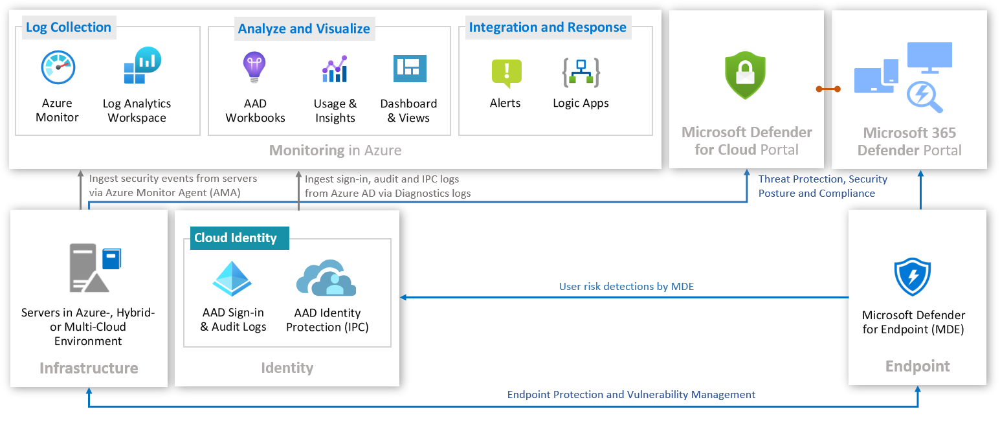

### Data Sources of "Azure Monitor Logs"

#### IaaS/PaaS (Cloud and on-Premises) in "Azure Monitor"

*[Azure Monitor](https://docs.microsoft.com/en-us/azure/azure-monitor?WT.mc_id=AZ-MVP-5003945) allows you to collect logs from the Azure platform and resources for visualization and alerting or forwarding to other destination (for long-term retention or advanced scenarios). In this use case we are using Microsoft "Log Analytics" to enable advanced (KQL-based) queries and centralized collection of logs*. *The following data sources should be considered to collect relevant information for your IAM security monitoring:*

- [Azure Activity Logs](https://docs.microsoft.com/en-us/azure/azure-resource-manager/management/view-activity-logs?WT.mc_id=AZ-MVP-5003945):
Platform logs of Azure which includes details on various events in your subscriptions and resources (including administrative activities, service health, recommendations). This covers also events on Control- and Management plane.
Changes of Azure RBAC but also operations on Managed Identities are also part of this activity logs.
    - [Collect and analyze Azure Activity Logs in Azure Monitor](https://docs.microsoft.com/en-us/azure/azure-monitor/platform/activity-log-collect?WT.mc_id=AZ-MVP-5003945)
    - [Data schema of Azure Audit Logs](https://docs.microsoft.com/en-us/azure/azure-monitor/platform/activity-log-schema?WT.mc_id=AZ-MVP-5003945?WT.mc_id=AZ-MVP-5003945)
- [Azure Resource Logs (Diagnostic Logs)](https://docs.microsoft.com/en-us/azure/azure-monitor/platform/resource-logs?WT.mc_id=AZ-MVP-5003945?WT.mc_id=AZ-MVP-5003945):
Insights and "Audit Logs" of operations that were performed within an "Azure resource" and "Data plane" are stored here. This includes the logging of identity and access (IAM)-related services such as "Azure KeyVault". You need to configure the [diagnostic settings to monitor access](https://docs.microsoft.com/en-us/azure/key-vault/general/howto-logging?WT.mc_id=AZ-MVP-5003945) of secrets and certificates which are stored in the vault.
- [Storage of Security Events in Log Analytics](https://docs.microsoft.com/en-us/azure/security-center/security-center-enable-data-collection?WT.mc_id=AZ-MVP-5003945#setting-the-security-event-option-at-the-workspace-level):
Collect all (security) events from servers in Azure and non-Azure/On-Premises infrastructure as part of the Microsoft Defender for Cloud and Azure Monitor Agent Data Collection.
    - [Collect data from physical/virtual server (hybrid environments) with Azure Monitor](https://learn.microsoft.com/en-us/azure/azure-monitor/agents/agents-overview?WT.mc_id=AZ-MVP-5003945)
    - Data Collection of "security logs" to Log Analytics can be [configured in "Microsoft Defender for Cloud"](https://docs.microsoft.com/en-us/azure/security-center/security-center-enable-data-collection#what-event-types-are-stored-for-common-and-minimal?WT.mc_id=AZ-MVP-5003945) by using [data collection rules](https://learn.microsoft.com/en-us/azure/azure-monitor/essentials/data-collection-rule-overview). It's recommended to use the same workspace for "Microsoft Defender for Cloud" and "Azure Monitor" logs.
      - Verify if your use cases are supported with Azure Monitor Agent and [compare features with legacy agents](https://learn.microsoft.com/en-us/azure/azure-monitor/agents/agents-overview?WT.mc_id=AZ-MVP-5003945#compare-to-legacy-agents)

#### Microsoft Defender for Cloud and "Azure Monitor"
Formely known as: Azure Security Center (ASC)

*[Continous Export](https://docs.microsoft.com/en-us/azure/security-center/continuous-export?WT.mc_id=AZ-MVP-5003945) allows to forward alerts and recommendations to "Azure Event Hub" or "Log Analytics". This solution was divided in two different scopes in the past: Free service "Security Center" as "Cloud security posture management (CSPM)" solution. Azure Defender as "Cloud workload protection (CWP)" add-on with licensing option to pay only for what you use. Both solutions are rebranded under the product name "Microsoft Defender for Cloud".*

- [Recommendations](https://docs.microsoft.com/en-us/azure/security-center/recommendations-reference?WT.mc_id=AZ-MVP-5003945#recs-identity):
Checks on-boarded subscriptions and their resources of recommendations around [Identity and access "resource security"](https://docs.microsoft.com/en-us/azure/security-center/security-center-identity-access?WT.mc_id=AZ-MVP-5003945).
    - [Reference Guide on Identity & Access Recommendations](https://docs.microsoft.com/en-us/azure/security-center/recommendations-reference#recs-identity)
- [Alerts](https://docs.microsoft.com/en-us/azure/security-center/alerts-reference?WT.mc_id=AZ-MVP-5003945):
Various types of IaaS and PaaS resources (VMs, App Service, Storage,…) will be protected against threats including identity-related attacks (e.g. "A logon from a malicious IP has been detected") or malware (e.g. Mimikatz or any "attack tools"). Triggering of alerts can be tested as described in the "[Alert validation](https://docs.microsoft.com/en-us/azure/security-center/security-center-alert-validation?WT.mc_id=AZ-MVP-5003945#validate-alerts-on-windows-vms-)" guide of Microsoft.
    - [Microsoft Defender for Servers](https://docs.microsoft.com/en-us/azure/security-center/defender-for-servers-introduction?WT.mc_id=AZ-MVP-5003945) and [Integration of Microsoft Defender for Endpoint](https://docs.microsoft.com/en-us/azure/security-center/security-center-wdatp?WT.mc_id=AZ-MVP-5003945):
    Alerts for [Windows](https://docs.microsoft.com/en-us/azure/security-center/alerts-reference?WT.mc_id=AZ-MVP-5003945#alerts-windows) and [Linux](https://docs.microsoft.com/en-us/azure/security-center/alerts-reference?WT.mc_id=AZ-MVP-5003945#alerts-linux) covers attack sources such as "anonymous or malicious IP addresses" and integrates "Microsoft Defender for Endpoint" for extended scenarios.
    You‘ll get advanced post-breach detections and alerts from "Endpoint Protection", alongside of automation of onboarding sensors.
        - [Playbook for Windows Servers](https://github.com/Azure/Azure-Security-Center/blob/master/Simulations/Azure%20Security%20Center%20Security%20Alerts%20Playbook_v2.pdf) includes step-by-step instruction to simulate attacks (such as "lateral movement").
        - [Audit logs of requests to "Just-in-Time Access"](https://docs.microsoft.com/en-us/azure/security-center/alerts-reference?WT.mc_id=AZ-MVP-5003945) are available in the "Activity Logs".
    - Microsoft Defender for PaaS and threat protection capabilities:
    Various Azure PaaS services such as [Azure App Service](https://docs.microsoft.com/en-us/azure/security-center/defender-for-app-service-introduction?WT.mc_id=AZ-MVP-5003945), [containers](https://docs.microsoft.com/en-us/azure/security-center/container-security), [SQL](https://docs.microsoft.com/en-us/azure/security-center/defender-for-sql-introduction) or [KeyVault](https://docs.microsoft.com/en-us/azure/security-center/defender-for-key-vault-introduction?WT.mc_id=AZ-MVP-5003945) can be also protected by "Azure Defender". Other platform services as the [management layer of Azure (Resource Manager)](https://docs.microsoft.com/en-us/azure/security-center/other-threat-protections?WT.mc_id=AZ-MVP-5003945) or [network layer](https://docs.microsoft.com/en-us/azure/security-center/other-threat-protections?WT.mc_id=AZ-MVP-5003945#threat-protection-for-azure-network-layer-) are also included. Detection of unusual or risky operations in the Azure subscription [are powered by MDA](https://docs.microsoft.com/en-us/azure/security-center/alerts-reference?WT.mc_id=AZ-MVP-5003945#alerts-azureresourceman).
- [Data schema](https://docs.microsoft.com/en-us/azure/security-center/alerts-schemas?tabs=schema-continuousexport?WT.mc_id=AZ-MVP-5003945) describes fields and data types of the MDC security alerts.

### Cloud Identity (Azure Active Directory) in "Azure Monitor"

[Routing of Azure AD activity logs](https://docs.microsoft.com/en-us/azure/active-directory/reports-monitoring/concept-activity-logs-azure-monitor?WT.mc_id=AZ-MVP-5003945) is natively supported to various targets such as Azure Event Hub, Blob Storage and Log Analytics.

- Supported reports in Azure Monitor (GA):
  - [Azure AD Sign-In Logs](https://docs.microsoft.com/en-us/azure/active-directory/reports-monitoring/concept-sign-ins?WT.mc_id=AZ-MVP-5003945):
  Overview of authentication and authorization events of all users.
  Details on the content are defined in the [sign-in logs schema](https://docs.microsoft.com/en-us/azure/active-directory/reports-monitoring/reference-azure-monitor-sign-ins-log-schema?WT.mc_id=AZ-MVP-5003945)
  - [Azure AD Audit Logs:](https://docs.microsoft.com/en-us/azure/active-directory/reports-monitoring/concept-audit-logs?WT.mc_id=AZ-MVP-5003945)
  Activities of tasks that is performed by a user or admin of your Azure AD tenant.
[Audit Log schema](https://docs.microsoft.com/en-us/azure/active-directory/reports-monitoring/reference-azure-monitor-audit-log-schema?WT.mc_id=AZ-MVP-5003945) defines the content of this activity log.
  - [Azure AD Provisioning Logs:](https://docs.microsoft.com/en-us/azure/active-directory/reports-monitoring/concept-provisioning-logs?WT.mc_id=AZ-MVP-5003945) This log gives you [detailed insights of provisioning](https://docs.microsoft.com/en-us/azure/active-directory/reports-monitoring/concept-provisioning-logs?WT.mc_id=AZ-MVP-5003945) users, roles and groups from or to Azure AD. [Log schema for Azure Monitor](https://docs.microsoft.com/en-us/azure/azure-monitor/reference/tables/aadprovisioninglogs?WT.mc_id=AZ-MVP-5003945) is also documented in MSDocs.
- Microsoft updated the logging capabilities in Azure AD as addition to the above mentioned classic "Azure AD Reports".
    - ["Non-interactive user" sign-ins](https://docs.microsoft.com/en-us/azure/azure-monitor/reference/tables/aadnoninteractiveusersigninlogs?WT.mc_id=AZ-MVP-5003945): Sign-in events which do not require the user to provide an authentication factor.  A client app or devices uses a token or code in background of the user's activity to authenticate or access a resource.
    - ["Service Principal" sign-ins](https://docs.microsoft.com/en-us/azure/azure-monitor/reference/tables/aadserviceprincipalsigninlogs?WT.mc_id=AZ-MVP-5003945): An app or service (with Application Identity) authenticates by using own credential to access resources. 
    - ["Managed identity" for Azure resource sign-ins](https://docs.microsoft.com/en-us/azure/azure-monitor/reference/tables/aadmanagedidentitysigninlogs?WT.mc_id=AZ-MVP-5003945): Sign-ins performed by Azure-managed resource(s) with assigned to user- or system-assigned managed identity.

- Azure AD Identity Protection Security Logs:
Identity Protection of Azure AD Premium [stores reports and events](https://docs.microsoft.com/en-us/azure/active-directory/reports-monitoring/reference-reports-data-retention?WT.mc_id=AZ-MVP-5003945#how-long-does-azure-ad-store-the-data) of risky users, sign-ins (up to 30 days) and detections (up to 90 days). Also signals from other products (e.g. MDE detection of "Possible attempt to access PRT") are stored in the risk events. [Diagnostic settings support for exporting Identity Protection data](https://docs.microsoft.com/en-us/azure/active-directory/identity-protection/howto-export-risk-data?WT.mc_id=AZ-MVP-5003945#log-analytics) is available for users and workload identities. KQL-based queries and custom alerting can be executed on the following categories and log tables:
    - [AADRiskyUsers](https://learn.microsoft.com/en-us/azure/azure-monitor/reference/tables/aadriskyusers?WT.mc_id=AZ-MVP-5003945) (report of risky users)
    - [AADUserRiskEvents](https://learn.microsoft.com/en-us/azure/azure-monitor/reference/tables/aaduserriskevents?WT.mc_id=AZ-MVP-5003945) (risk detections of users)
    - [AADRiskyServicePrincipals](https://learn.microsoft.com/en-us/azure/azure-monitor/reference/tables/aadriskyserviceprincipals?WT.mc_id=AZ-MVP-5003945) (report of risky workload identities)
    - [AADServicePrincipalRiskEvents](https://learn.microsoft.com/en-us/azure/azure-monitor/reference/tables/aadserviceprincipalriskevents?WT.mc_id=AZ-MVP-5003945) (risk detections of workload identities)
    - In general, various "[risk detections](https://docs.microsoft.com/en-us/azure/active-directory/identity-protection/concept-identity-protection-risks?WT.mc_id=AZ-MVP-5003945)" are available in Identity Protection which will be calculated in real-time or offline.
    Risk state triggers "auto-response actions" and offers "self-remediation options" that will be managed by [identity protection policies](https://docs.microsoft.com/en-us/azure/active-directory/identity-protection/concept-identity-protection-policies?WT.mc_id=AZ-MVP-5003945) or as part of Conditional Access Policies.
    - [Microsoft Graph APIs](https://docs.microsoft.com/en-us/azure/active-directory/identity-protection/howto-identity-protection-graph-api?WT.mc_id=AZ-MVP-5003945) allows you to collect this data for export or automate response to risk detections.
    - [Every Azure AD Sign-in log](https://docs.microsoft.com/en-us/graph/api/signin-list?view=graph-rest-1.0&tabs=http) includes the following properties related to the identity risk detection: riskDetail, riskLevelAggregated, riskLevelDuringSignIn, riskState, riskEventTypes.

        
        _Risk detections from "Defender for Cloud Apps" (such as "Impossible Travel") will be also displayed in the "Identity Protection" blade (Azure portal). Correlation between sign-in event and offline detections by Identity Protection (in this sample "Password Spray, Malicious IP address and Atypical travel) can be established by Request or CorrelationID._

        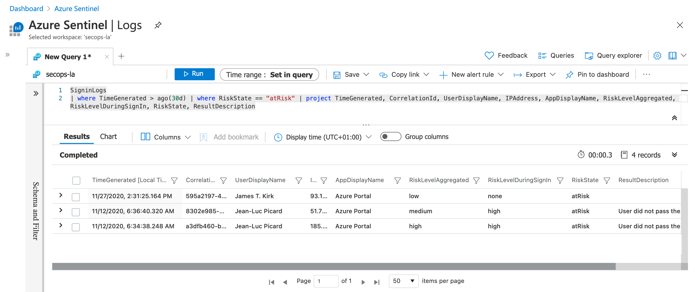
        _Collected "sign-in events" in "Azure Monitor Logs" will be enriched with "RiskState" and "RiskLevelDuringSign" if a risky sign-in was detected (in real-time or sign-in attempt was made after risk detection)._

### Log Collection (via "Azure Monitor")

- [Log Analytics](https://docs.microsoft.com/en-us/azure/azure-monitor/log-query/log-query-overview?WT.mc_id=AZ-MVP-5003945):
Azure's native "Log Management Solution" enables deep analytics and advanced queries in case of troubleshooting or technical investigation. [Kusto (KQL)](https://docs.microsoft.com/en-us/azure/data-explorer/kusto/query?WT.mc_id=AZ-MVP-5003945) is the query language that you should use (and learn).
This is the foundation of many features and primary query language in solutions such as as "Microsoft Sentinel" (built on top of Log Analytics) or "Azure AD Workbooks" (sourced log data from a workspace). Other monitoring solutions in the "Azure platform" are using also "Log Analytics workspaces" to store data (e.g. App Insights).

### Analyze and Visualize with "Azure Monitor"

- [Azure AD Workbooks](https://docs.microsoft.com/en-us/azure/active-directory/reports-monitoring/howto-use-azure-monitor-workbooks?WT.mc_id=AZ-MVP-5003945):
Microsoft provides built-in visualization which requires Log Analytics workspace. They are very helpful to analyze (and troubleshoot) activities around Authentication, Conditional Access, [Sign-in health](https://docs.microsoft.com/en-us/azure/active-directory/fundamentals/monitor-sign-in-health-for-resilience?WT.mc_id=AZ-MVP-5003945), [Sensitive Operations of Service Principals/Authentication Methods](https://techcommunity.microsoft.com/t5/azure-active-directory-identity/azure-ad-workbook-to-help-you-assess-solorigate-risk/ba-p/2010718?WT.mc_id=M365-MVP-5003945) and other identity-related operations.
- [Azure AD Dashboards](https://docs.microsoft.com/en-us/azure/active-directory/reports-monitoring/howto-install-use-log-analytics-views?WT.mc_id=AZ-MVP-5003945):
Azure AD Dashboard views are available for "Account Provisioning" and "Sign-In Events" but seems little bit outdated.
- [Usage and Insights](https://docs.microsoft.com/en-us/azure/active-directory/authentication/howto-authentication-methods-usage-insights?WT.mc_id=AZ-MVP-5003945):
An overview about registered/usage of "authentication methods" and "Azure AD-integrated apps" activity are available in the "Azure Portal". These usage statistics are also available via "[Microsoft Graph API](https://docs.microsoft.com/en-us/graph/api/resources/authenticationmethods-usage-insights-overview?view=graph-rest-beta)". The following [sample script](https://docs.microsoft.com/en-us/samples/azure-samples/azure-mfa-authentication-method-analysis/azure-mfa-authentication-method-analysis/) analyse the statistics to make recommendations.
- Log Analytics Solutions:
    - [AD Health Check](https://docs.microsoft.com/en-us/azure/azure-monitor/insights/ad-assessment?WT.mc_id=AZ-MVP-5003945):
    Optimize your Active Directory environment with the "Active Directory Health Check" solution in Azure Monitor
    - [AD Replication Status](https://docs.microsoft.com/en-us/azure/azure-monitor/insights/ad-replication-status?WT.mc_id=AZ-MVP-5003945):
    Monitor your "Active Directory replication status" with Azure Monitor
- [Azure Security Benchmark Workbook](https://techcommunity.microsoft.com/t5/microsoft-defender-for-cloud/what-s-new-azure-security-benchmark-workbook-preview?WT.mc_id=AZ-MVP-5003945): Visualization of data collected by Microsoft Defender for Cloud to check compliance status in alignment with the Azure Security Benchmark (ASB). This contains also security controls regarding Identity Management and Privileged Access in Azure.

### Integration and Response in "Azure Monitor"

- [Alerts and Logic Apps](https://docs.microsoft.com/en-us/azure/active-directory/authentication/howto-authentication-methods-usage-insights?WT.mc_id=AZ-MVP-5003945):
Azure Monitor is able to trigger complex actions based on defined rules (such as [signal logic based on KQL custom log search](https://docs.microsoft.com/en-us/azure/active-directory/authentication/howto-authentication-methods-usage-insights?WT.mc_id=AZ-MVP-5003945)). This gives you many options to integrate your workflows as part of "Azure Logic Apps" or any other 3rd Party systems.
    - Samples of "Azure Monitor Alerts":
        - [Monitor your Azure AD Break Glass Accounts with Azure Monitor
        (Blog post by Daniel Chronlund](https://danielchronlund.com/2020/01/22/monitor-your-azure-ad-break-glass-accounts-with-azure-monitor/))
        - [Azure AD App Tracking with Logic Apps (Blog post by Microsoft Developer Support)](https://devblogs.microsoft.com/premier-developer/azure-ad-app-tracking-with-logic-apps/)

### Considerations and References of Azure AD Logging by "Azure Monitor"
- It's very important to have a deep understanding of the Azure AD architecture to cover all components for security monitoring. Microsoft has released an architecture description which gives a good overview of [Azure AD for SecOps Teams](https://docs.microsoft.com/en-us/azure/architecture/example-scenario/aadsec/azure-ad-security?WT.mc_id=AZ-MVP-5003945).
- Microsoft has published an ["SecOps Guide" for Azure AD](https://docs.microsoft.com/en-us/azure/active-directory/fundamentals/security-operations-introduction?WT.mc_id=AZ-MVP-5003945) which offers an overview of many identity security configuration and what should be monitored. This includes query samples, source of logs and notes on detections.
- "[Deployment guide of Azure AD Monitoring](https://docs.microsoft.com/en-us/azure/active-directory/reports-monitoring/plan-monitoring-and-reporting?WT.mc_id=AZ-MVP-5003945)” from Microsoft gives you an general overview of aspects and options to integrate or archive logs. The [latency of Azure AD logging and the risk detections](https://docs.microsoft.com/en-us/azure/active-directory/reports-monitoring/reference-reports-data-retention?WT.mc_id=AZ-MVP-5003945) should be also considered (for your security response and processes).
- Follow steps on the [Microsoft Defender for Cloud Enterprise Onboarding Guide](https://github.com/Azure/Microsoft-Defender-for-Cloud/tree/main/Onboarding) to identify requirements, recommendations and deployment tasks.
- [Retention of the reports](https://docs.microsoft.com/en-us/azure/active-directory/reports-monitoring/reference-reports-data-retention?WT.mc_id=AZ-MVP-5003945) depends on type of activity and your Azure AD license.
- [Costs](https://docs.microsoft.com/en-us/azure/active-directory/reports-monitoring/concept-activity-logs-azure-monitor#azure-monitor-logs-cost-considerations) should be calculated based on the requirements for long-term retention.
- Pay attention to missing audit logs of privileged activities in Azure Monitor.
    - Example: [Azure EA portal and changes of ownership will not be audited](https://www.cloud-architekt.net/azure-ea-management-security-considerations/?WT.mc_id=AZ-MVP-5003945) but has effects on Azure RBAC!
- [Rate limitation of "Azure Alerts"](https://docs.microsoft.com/en-us/azure/azure-monitor/platform/alerts-rate-limiting?WT.mc_id=AZ-MVP-5003945) should be considered for your service emergency and operational notifications.
- [Identity Protection provides APIs](https://docs.microsoft.com/en-us/graph/api/resources/identityprotection-root?view=graph-rest-beta) to get events and risk status of your users.
- I can strongly recommended to test and validate the detection mechanism in "Identity Protection" (as described in the [blog post by Sami Lampuu](https://samilamppu.com/2020/10/09/azure-ad-identity-protection-deep-diver-part-2/)). Take care on the delay and latency between attack and detection of the various mechanism. Keep in mind, risk response (as part of the "Risk Policies") must be in accord with your Azure AD implementation.
    - Example: Force password change by risky sign-in detection works only in hybrid environments if password write-back is allowed.
- Consider the limitations and behavior of "[Identity Protection and External Users (B2B Guests)](https://docs.microsoft.com/en-us/azure/active-directory/identity-protection/concept-identity-protection-b2b?WT.mc_id=AZ-MVP-5003945)"
- Hybrid identity environment: Collect and monitor [logs from "Azure AD Connect" servers](https://docs.microsoft.com/en-gb/troubleshoot/azure/active-directory/installation-configuration-wizard-errors#troubleshoot-additional-error-messages) and the ["Password Hash Sync" agent](https://docs.microsoft.com/en-gb/troubleshoot/azure/active-directory/troubleshoot-pwd-sync?WT.mc_id=AZ-MVP-5003945#event-id-messages-in-event-viewer).
- You might be facing the follow considerations in your daily work experiences:
    - Name in reports are based on the object name at the time of the event/sign-in
    - B2B users are able to get "user insights” and therefore internal information
    - Users can review the sign-in history as part of the "[My-Sign-Ins](https://techcommunity.microsoft.com/t5/azure-active-directory-identity/users-can-now-check-their-sign-in-history-for-unusual-activity/ba-p/916066?WT.mc_id=M365-MVP-5003945)" portal and give feedback on suspicious activities ("This wasn't me" option).
    - Non-Global Admins can access logs
        - Security Administrator & Reader
        - Reports Reader and Application Administrator
        - Global Reader
- Microsoft "[Identity Secure Score](https://docs.microsoft.com/en-us/azure/active-directory/fundamentals/identity-secure-score?WT.mc_id=AZ-MVP-5003945)" is recommended for regular check as part of your (cloud) "identity security posture management" and can be integrated in your monitoring via [Security Graph API](https://docs.microsoft.com/en-us/graph/api/securescore-get?view=graph-rest-1.0&tabs=http).
- [Customer-managed keys](https://docs.microsoft.com/en-us/azure/azure-monitor/platform/customer-managed-keys?WT.mc_id=AZ-MVP-5003945) can be configured and are supported for encryption in "Azure Monitor".
- Self-Service Password Reset (SSPR): Monitor blocked attempts or suspicious activity via [Azure Monitor Alerts or Microsoft Sentinel](https://www.cloud-architekt.net/azuread-sspr-deployment-and-detection/)
- Consider service principal logs and the challenges to build relation to "Azure Activity" or "(Azure) DevOps Deployment pipeline" logs, [as described in my previous blog post](https://www.cloud-architekt.net/auditing-of-msi-and-service-principals/)!
- Currently, there are four different "Windows Agents"  for Azure Monitor available. Read the Microsoft Docs article to get an overview of the various [Azure Monitor agents](https://docs.microsoft.com/en-us/azure/azure-monitor/agents/agents-overview?WT.mc_id=AZ-MVP-5003945). The "new" Azure Monitor agent (AMA) is "General Available" (GA) and will be the consolidated solution. Consider that previous/legacy agents will be deprecated. Keep in mind to migrate your [integrations to the "new" Azure Monitor Agent](https://docs.microsoft.com/en-us/azure/azure-monitor/agents/azure-monitor-agent-overview?tabs=PowerShellWindows?WT.mc_id=AZ-MVP-5003945#supported-services-and-features) until August 31, 2024 (End-of-support for Log Analytics Agent)
- Marius Sandbu has written an excellent ["deep dive" article about "Azure Monitor" and "Log Analytics"](https://msandbu.org/deep-dive-azure-monitor-and-log-analytics/) which is strongly recommended to read for a good understanding of the architecture.

## MDA and "Defender for Identity": Unified SecOps of connected "Cloud Apps" and "Hybrid Identity"

*Sample use case: SecOps that manages security of cloud platforms or SaaS solutions and need an unified view for investigation or alerting on (hybrid) identities.*

### Data Sources in Microsoft Defender for Cloud Apps (MDA)

#### IaaS/PaaS (Cloud and on-Premises) in MDA

*MDA allows you to [connect Microsoft‘s Azure platform](https://docs.microsoft.com/en-us/cloud-app-security/connect-azure-to-microsoft-cloud-app-security?WT.mc_id=AZ-MVP-5003945) and other cloud platform provider ([AWS](https://docs.microsoft.com/en-us/cloud-app-security/connect-aws-to-microsoft-cloud-app-security?WT.mc_id=AZ-MVP-5003945) and [Google Cloud Platform](https://docs.microsoft.com/en-us/cloud-app-security/connect-google-gcp-to-microsoft-cloud-app-security)) via "App Connector". This makes "Activity logs" available in MDA for investigation and trigger alerts. The security configuration of "Google Cloud" and "Amazon Web Services" (AWS) can be integrated to provide fundamental security recommendations based on the CIS benchmark.* 

#### Microsoft Defender for Cloud and MDA-Integration
*Security Configuration [Assessment results](https://docs.microsoft.com/en-us/cloud-app-security/security-config?WT.mc_id=AZ-MVP-5003945) of MDA will be collected from "Microsoft Defender for Cloud". This gives you a common view of the [security posture, usage of cloud resources and suspicious activities](https://docs.microsoft.com/en-us/cloud-app-security/tutorial-cloud-platform-security) across your cloud infrastructure assets (in Microsoft Azure).*

_Side note: It's strongly recommended to have a look on the Multi-Cloud Posture Management features in "Microsoft Defender for Cloud" (MDC) to integrate 3rd Party Cloud providers (AWS, Google Cloud). There are a couple of benefits to use the Azure Portal and MDC for review of security configuration and assessments_ 

#### Cloud Identity in MDA

*Azure AD audit and sign-in events are covered by the "Office 365 connector" in MDA. But only interactive sign-in activities and sign-in activities from legacy protocols seems to be included.

Advanced categories such as "Service Principals" aren't covered by the connector.* 

- Severity of (cloud) identity risk alerts can be managed by [MDA integration of "AAD Identity Protection"](https://docs.microsoft.com/en-us/cloud-app-security/aadip-integration?WT.mc_id=AZ-MVP-5003945).
- Detections of "Identity Protection" are part of the UEBA/investigation priority score and will be also displayed on the user page.
    - Some identity [risk detections will be detected by MDA](https://docs.microsoft.com/en-us/azure/active-directory/identity-protection/concept-identity-protection-risks#sign-in-risk) (such as "impossible travel" or "inbox manipulation rule") and results will be forwarded to Azure AD Identity Protection (and displayed in the portal blade as well).
    Follow the [Identity protection playbook](https://docs.microsoft.com/en-us/azure/active-directory/identity-protection/howto-identity-protection-simulate-risk?WT.mc_id=AZ-MVP-5003945) to simulate the attack scenarios and trigger the detection/response.

_"Identity Protection" risk detections will be listed in the MDA alerts view._

#### On-Premises Identity (Active Directory) in MDA

[Microsoft Defender for Identity](https://docs.microsoft.com/en-us/azure-advanced-threat-protection/what-is-atp?WT.mc_id=AZ-MVP-5003945) (MDI) allows you to detect and identify attacks in your "on-premises environment". It‘s based on monitoring and profiling of user behavior and activities. MDI includes the [detection of Lateral Movement Paths (LMP)](https://techcommunity.microsoft.com/t5/microsoft-security-and/reduce-your-potential-attack-surface-using-azure-atp-lateral/ba-p/291787?WT.mc_id=M365-MVP-5003945) which is strongly recommended to consider. Keep in mind, machine-learning on user/entity-related behavioral needs a learning period. 

- [Security Alerts](https://docs.microsoft.com/en-us/azure-advanced-threat-protection/suspicious-activity-guide?tabs=cloud-app-security#security-alert-name-mapping-and-unique-external-ids?WT.mc_id=AZ-MVP-5003945) are categorized in phases of the "CyberAttack kill-chain" and are [well documented](https://docs.microsoft.com/en-us/defender-for-identity/suspicious-activity-guide?tabs=external) by Microsoft.
- [Remediation actions](https://learn.microsoft.com/en-us/defender-for-identity/remediation-actions?WT.mc_id=AZ-MVP-5003945) allows disable, suspend or reset passwords of user in Active Directory. It's recommended to [create a gMSA account](https://learn.microsoft.com/en-us/defender-for-identity/manage-action-accounts?WT.mc_id=AZ-MVP-5003945) as action accounts.
- [Integration of MDI with MDA](https://docs.microsoft.com/en-us/defender-for-identity/mcas-integration?WT.mc_id=AZ-MVP-5003945) is mandatory for environments where both solutions are in use. More and more features around MDI seems to be moved to the MDA portal (such as the new "hunting experiences"). All activities and detections of MDI will be also included in the UEBA if integration is configured.

    
    _Attacks on Active Directory (On-Premises) will be detected by MDI and generates an alert. This screenshots shows the alert in the legacy MDI ("Azure ATP") portal._

    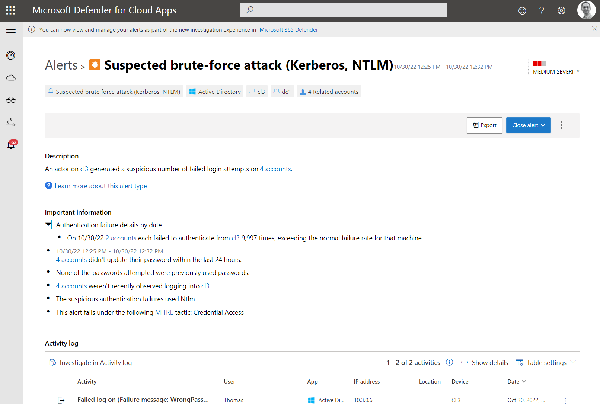
    _In the recent years, Microsoft has been implemented a "new" hunting experience which allows to use MDA portal for unified incident management between "Active Directory" and "Azure AD" alerts._
    

    - MDA is using MDI data as source to collect activities from Active Directory as an "app". This gives you an "unified activity" overview of an user in "Azure AD", "Active Directory" and "MDA connected apps".

    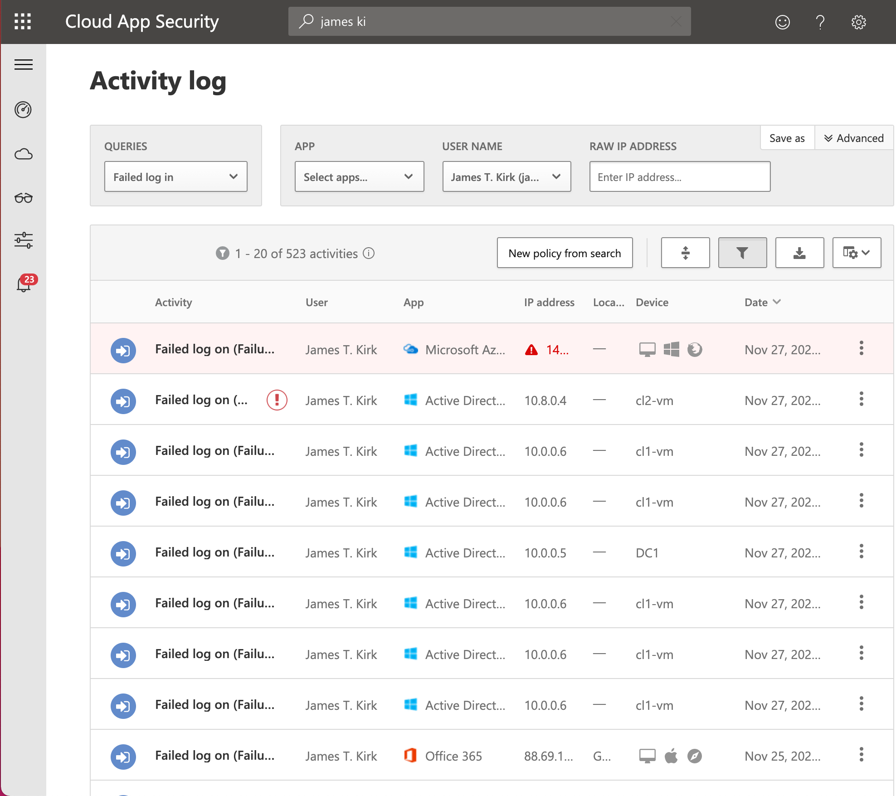
    _Example: Failed sign-in attempts to Active Directory or connected apps (in this case, "Azure Portal" and "Office 365")._

- All alerts and events of MDI can be exported in [CEF format](https://docs.microsoft.com/en-us/defender-for-identity/cef-format-sa?WT.mc_id=AZ-MVP-5003945).
- Regular updates on detections includes improvements of existing capabilties but also adding new detection methods that raised up. A good example was the [vulnerability detection of ZeroLogon](https://www.microsoft.com/security/blog/2020/11/30/zerologon-is-now-detected-by-microsoft-defender-for-identity/) in November 2020.
- Details on managing and investigation are very well documented in a TechCommunity blog article about ["daily operation of MDI"](https://techcommunity.microsoft.com/t5/core-infrastructure-and-security/microsoft-defender-for-identity-azure-atp-daily-operation/ba-p/1831024). Another article in this series describes details on ["Deployment and Troubleshooting"](https://techcommunity.microsoft.com/t5/core-infrastructure-and-security/microsoft-defender-for-identity-azure-atp-deployment-and/ba-p/1676122?WT.mc_id=M365-MVP-5003945).

#### Cloud Session Monitoring by MDA

*Microsoft Cloud Access Security Broker (CASB) enables you to identify usage of cloud apps, insights of risk assessments and capabilities to control the sessions and access to the cloud apps. There are some features that are essential for monitoring your identities and their access to sanctioned or unsanctioned resources or apps:*

- "Cloud Discovery" allows you to detect usage of cloud apps from proxy/firewall logs or [machine-based discovery (from MDE)](https://docs.microsoft.com/en-us/cloud-app-security/mde-integration?WT.mc_id=AZ-MVP-5003945). Integrated "Cloud App Catalog" shows a "risk score" and detailed information (security factors, industry- and legal regulations) to discovered apps. Classification as "unsanctioned" will start blocking the usage of the app.
    - [Microsoft Defender for Endpoint (MDE) in MDA](https://techcommunity.microsoft.com/t5/microsoft-security-and/microsoft-cloud-app-security-and-windows-defender-atp-better/ba-p/263265?WT.mc_id=M365-MVP-5003945) has many benefits around ["Cloud Discovery"](https://docs.microsoft.com/en-us/cloud-app-security/mde-integration) (ingestion of discovered machine data) and the usage of [custom network indicators](https://techcommunity.microsoft.com/t5/microsoft-security-and/block-access-to-unsanctioned-apps-with-microsoft-defender-atp/ba-p/1121179?WT.mc_id=M365-MVP-5003945) (to block unsanctioned cloud apps).
    - Discovery logs can be [enriched with "Azure AD" username data](https://docs.microsoft.com/en-us/cloud-app-security/cloud-discovery-aad-enrichment?WT.mc_id=AZ-MVP-5003945). This replaces the original username from the proxy or firewall traffic logs by the Azure AD user name.
- ["App Governance" is an add-on to MDA](https://techcommunity.microsoft.com/t5/security-compliance-and-identity/announcing-public-preview-of-app-governance/ba-p/2543768?WT.mc_id=M365-MVP-5003945) which helps to protect and govern your apps. This solution is in public preview. It allows to get [detailed insights from all integrated apps](https://docs.microsoft.com/en-us/microsoft-365/compliance/app-governance-visibility-insights-get-started?WT.mc_id=AZ-MVP-5003945) to the M365 platform and create [advanced policies for proactive protection or reactive response](https://docs.microsoft.com/en-us/microsoft-365/compliance/app-governance-app-policies-get-started?WT.mc_id=AZ-MVP-5003945) but also triggered by [detected anomalies in app activity](https://docs.microsoft.com/en-us/microsoft-365/compliance/app-governance-detect-remediate-get-started?WT.mc_id=AZ-MVP-5003945). Check out the blog post by Sami Lamppu if you like to know more about [using "App Governance" to monitor and govern apps](https://samilamppu.com/2021/08/12/using-app-governance-MDCA-add-on-to-monitor-and-govern-apps/).
- MDA provides "[App Connectors](https://docs.microsoft.com/en-us/cloud-app-security/enable-instant-visibility-protection-and-governance-actions-for-your-apps?WT.mc_id=AZ-MVP-5003945)" for some cloud provider to get advanced visibility and protection of sanctioned/connected apps. Insights of user/access management, activity logs and file/sharing control will be collected via "API connections" to the supported cloud products (GitHub Enterprise, ServiceNow, etc.).
- Sessions to Azure AD-integrated apps can be managed (for limited access) in MDA with "Conditional Access App Control". MDA acts as a [reverse proxy to control sessions](https://docs.microsoft.com/en-us/cloud-app-security/proxy-intro-aad#how-it-works?WT.mc_id=AZ-MVP-5003945) of the configured cloud app. This gives you [various compliance options](https://docs.microsoft.com/en-us/cloud-app-security/tutorial-proxy?WT.mc_id=AZ-MVP-5003945) such as preventing data exfiltration or real-time monitoring of user activity (anomalies) in the session.

_MDA allows to get insights of suspicious user behavior in the session to a connected cloud app (such as download/upload to OneDrive and SharePoint). Custom activity alerts are also possible (like in this example, activity by "Global Admin to gain elevated access to Azure Management scope")._

#### Collaboration Platforms (Office 365 Services) in MDA

*Microsoft‘s Office 365 but also other collaboration platforms ([Dropbox](https://docs.microsoft.com/en-us/cloud-app-security/connect-dropbox-to-microsoft-cloud-app-security?WT.mc_id=AZ-MVP-5003945) and [G-Suite](https://docs.microsoft.com/en-us/cloud-app-security/connect-google-apps-to-microsoft-cloud-app-security?WT.mc_id=AZ-MVP-5003945)) or SaaS provider can be connected via "app connectors". This gives you options to visibility, governance and protection of those services. Level of centralized management in MDA depends on abilities that are [supported by the connector](https://docs.microsoft.com/en-us/cloud-app-security/enable-instant-visibility-protection-and-governance-actions-for-your-apps?WT.mc_id=AZ-MVP-5003945).* 

- [App Connector of "Office 365"](https://docs.microsoft.com/en-us/cloud-app-security/connect-office-365-to-microsoft-cloud-app-security?WT.mc_id=AZ-MVP-5003945) will be also used to source the following "Azure AD" information and are prerequisites for the identity monitoring capabilities in MDA:
    - Azure AD Users and groups (Meta information of those objects in the tenant)
    - Azure AD Management events (Audit Logs)
    - Sign-in events (Interactive Sign-in activities and activities from legacy protocols such as ActiveSync)
    - Azure AD Apps (registered "OAuth" apps)
- Audit data will be ingested from the "Office 365 Management Activity API". A deep dive description of collecting this audit events are very well described in [a blog post by Sami Lamppu](https://samilamppu.com/2020/08/07/office-365-audit-events-visibility-in-cloud-app-security/).
In general, the audit log from "Office 365 Security and Compliance Portal" shows the same level of information as the activity log from the MDA "app connector".
    - Description of [audited activities in Office 365](https://docs.microsoft.com/en-us/microsoft-365/compliance/search-the-audit-log-in-security-and-compliance?WT.mc_id=M365-MVP-5003945#audited-activities)
    - Detailed [properties of the Office 365 audit log](https://docs.microsoft.com/en-us/microsoft-365/compliance/detailed-properties-in-the-office-365-audit-log?WT.mc_id=M365-MVP-5003945)
- Alerts of "Microsoft Defender for Office 365" (MDO) are also visible in the "MDA Activity Log" and allows you to create custom policies in MDA. Sami Lamppu has also given some details about this [in one of his blog posts](https://samilamppu.com/2020/05/19/detect-o365-atp-alerts-in-cloud-app-security-and-microsoft-threat-protection/).

#### Device / Endpoint Security (Microsoft Defender for Endpoint) Integration in MDA

*"Microsoft Defender ATP" (MDATP) Portal was rebranded to "[Microsoft Defender Security Portal](https://docs.microsoft.com/en-us/windows/security/threat-protection/microsoft-defender-atp/portal-overview?WT.mc_id=M365-MVP-5003945)" in the fall of 2020. Microsoft's Endpoint and Detection and Response (EDR) solution allows [deep integration to MDA](https://techcommunity.microsoft.com/t5/microsoft-security-and/microsoft-cloud-app-security-and-windows-defender-atp-better/ba-p/263265?WT.mc_id=M365-MVP-5003945). But also insights from MDA will be displayed in the (new) Endpoint Security Portal.*

Signal forwarding from "Microsoft Defender for Endpoint" (MDE) to MDA is an essential configuration to establish the visibility of "cloud app usage" and control of unwanted apps (as described previously). But it's also extend the "MDA Discovery Dashboard" with an additional "machine-centric" view. This allows you to start investigation based on a specific machine and correlate statistics of risky apps, transaction/traffic and device risk (calculated by MDE) right from MDA. A direct (deep) link to the machine object helps to continue the investigation in the "Microsoft Defender Security Center" (MDE Portal).

### Analyze and Visualize with MDA

#### User and Entity Behavior Analytics (UEBA) in MDA

- [(Hybrid) Identity Threat Investigation](https://www.youtube.com/watch?v=znsX3ssctNM): The "user page" in MDA gives you an overview and correlated information from all connected apps or integrated "threat protection solutions" in a single view. This is also a landing page to get all related and collected information about activities (from the "Activity Log"), alerts (filtered by selected user) or actions by policies ("Governance Log").
User Exposure information shows summary from various sources (e.g. number of accounts that are correlated by app connector).
Activities of the users can be filtered and will be enriched by MDA (such as Internal/External users, Status as admin account or critical role/group assignment).
    - User page and "hunting experiences" in "Microsoft Defender for Identity" will be probably moved to the MDA portal.
    - Device page is also available for all MDI device objects and shows open alerts and summary of activities (logged on users, resource access, IPs)
- [Investigation Priority Score](https://docs.microsoft.com/en-us/azure/active-directory/reports-monitoring/concept-audit-logs?WT.mc_id=AZ-MVP-5003945):
This score helps to identify the riskiest users across the various signals, alerts and integrations. Therefore, the "Investigation Priority" pulls together signals from connected apps and integrated threat protections (MDI and "Azure AD Identity Protection") to find abnormal behavior and aggregate this into a single score value. This score will be displayed on the "MDA dashboard" and in the user page for [further investigation](https://docs.microsoft.com/en-us/cloud-app-security/tutorial-ueba?WT.mc_id=M365-MVP-5003945).
    - Matt Soseman has recorded a [YouTube video](https://mattsoseman.wordpress.com/2020/07/08/ueba-in-microsoft-cloud-app-security-user-entity-behavior-analytics/) about it which includes the calculation of the score and some demo on investigation in the "UEBA".
    - Consider to [tune the policies for anomaly detection](https://docs.microsoft.com/en-us/cloud-app-security/tutorial-suspicious-activity?WT.mc_id=M365-MVP-5003945) and review the default governance actions after enabling the data sources (threat protections, connected apps and discovery logs).

    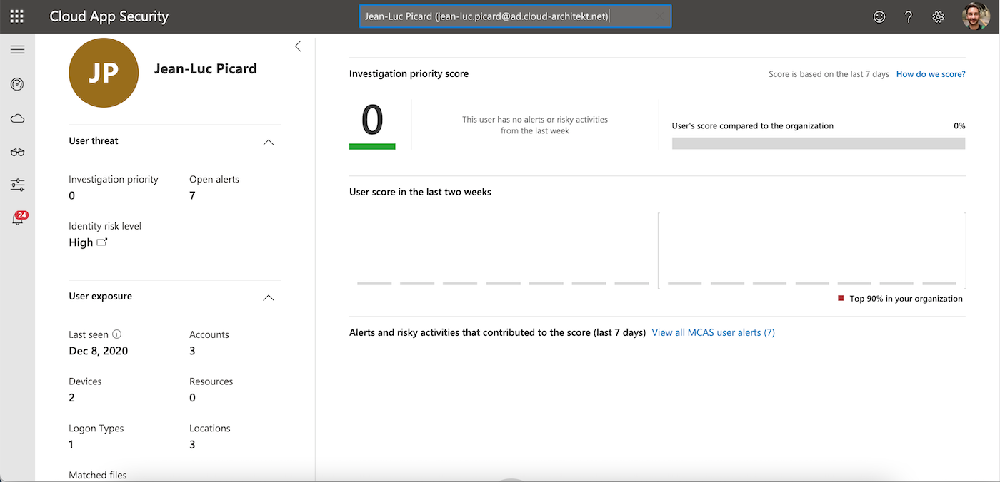
    _Alerts and activities of the last 7 days will be shown in the user page only. "Investigation priority" only considered the threats within this time range. So keep in mind, the total number of "open alerts" in the "user threat" panel._

#### Identity Security Posture and Apps Inventory with MDA

- [Identity Security Posture](https://docs.microsoft.com/en-us/defender-for-identity/isp-overview?WT.mc_id=M365-MVP-5003945):
Assessment of various security critical "Active Directory" configurations that includes also instructions to remediate or resolve the findings.
- [Manage OAuth apps](https://docs.microsoft.com/en-us/cloud-app-security/manage-app-permissions?WT.mc_id=M365-MVP-5003945):
Risky apps can be [investigated by the discovered "OAuth apps" in MDA](https://docs.microsoft.com/en-us/cloud-app-security/investigate-risky-oauth?WT.mc_id=M365-MVP-5003945). Furthermore, you should also be able to [configure an app policy](https://docs.microsoft.com/en-us/cloud-app-security/app-permission-policy) to monitor "OAuth apps" on various criteria (incl. permission level) and revoke the app (if needed).
    - Built-in ["OAuth" app anomaly detection policies](https://docs.microsoft.com/en-us/cloud-app-security/app-permission-policy#oauth-app-anomaly-detection-policies?WT.mc_id=M365-MVP-5003945) are already configured to detect malicious consent grants, misleading publisher/product names or activity to suspicious apps.

#### Integration and Responds in MDA

- [Policies:](https://docs.microsoft.com/en-us/cloud-app-security/control-cloud-apps-with-policies?WT.mc_id=M365-MVP-5003945)
Control of your identities in connected apps/resources can be achieved by monitored activities and signals by MDA. The following types of policies can be configured:
    - [Access Policies](https://docs.microsoft.com/en-us/cloud-app-security/access-policy-aad?WT.mc_id=M365-MVP-5003945) gives you the ability for real-time monitoring and control the access on your "connected apps". The applied actions ("Monitor" or "Block") can be filtered on advanced criteria such as device tags, source of access (IP address), client app or user/app scope.
    - [Session Policies](https://docs.microsoft.com/en-us/cloud-app-security/session-policy-aad?WT.mc_id=M365-MVP-5003945) enables real-time action and monitoring within the session and allows to block or restrict on specific activities (such as sharing or file control).
    - [Activity Policies](https://docs.microsoft.com/en-us/azure/active-directory/reports-monitoring/concept-audit-logs?WT.mc_id=AZ-MVP-5003945) enforces automated response on a specific or repeated activity to a connected app. As a response, governance actions can enforce security mechanism on API level by "connected app" (e.g. require sign-in prompt in Office 365), user account state in Azure AD (e.g. disable user) or custom playbook (PowerAutomate).
    Activities of tasks that is performed by a user or admin of your Azure AD tenant.
    - [Anomaly Detection Policies](https://docs.microsoft.com/en-us/cloud-app-security/anomaly-detection-policy) are enabled to find unusual activities and trigger an alert if unusual behavior was detected (different from user's regular activity). They are part of the UEBA and ML capabilities which are integrated in MDA and displayed in the "User Page" / "Investigation Priority Score". Built-in policies covers activities from specific activities in a connected app (e.g. connected "Azure Instance" and "Multiple delete VM activities") to find anomalies of a single user session ("Unusual activities by user"). Some anomaly detection policies [can be tuned or scoped](https://docs.microsoft.com/en-us/cloud-app-security/anomaly-detection-policy#tune-anomaly-detection-policies) to adjust sensitivity or customize automated response.

    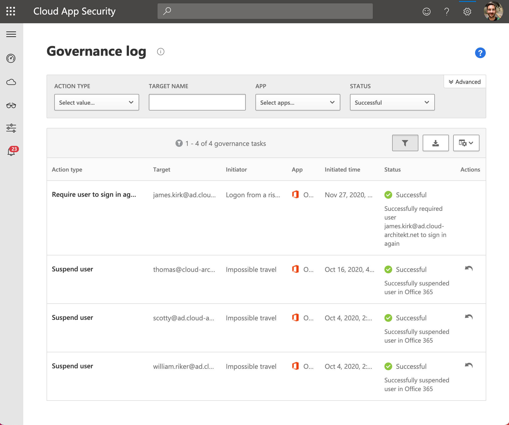
    _Governance log shows actions (initiated by policies) of automated response on alerts (such as require user to sign-in again if a risky sign-in was detected)._

- [Policy Templates](https://docs.microsoft.com/en-us/cloud-app-security/policy-template-reference):
Before creating your own policies, check the built-in templates in MDA that are ready for use. Many of them are essential and strongly recommended to be enabled and configured in your MDA instance.
- [PowerAutomate](https://docs.microsoft.com/en-us/azure/active-directory/reports-monitoring/concept-audit-logs?WT.mc_id=AZ-MVP-5003945):
Automation of (governance) actions can be realized by "PowerAutomate". Microsoft has released some sample playbooks for auto-remediation or -response scenarios on [GitHub](https://github.com/microsoft/Microsoft-Cloud-App-Security/tree/master/Playbooks).
    - Other samples such as "[Request user validation](https://techcommunity.microsoft.com/t5/microsoft-security-and/alert-new-blog-series-automation-in-cloud-app-security/ba-p/1608357)" or "[auto-triage infrequent country alerts](https://techcommunity.microsoft.com/t5/microsoft-security-and/auto-triage-infrequent-country-alerts-using-MDCA-amp-power/ba-p/1644980?WT.mc_id=M365-MVP-5003945)" are documented as part of this TechCommunity blog series.

### Considerations and References of "Defender for Cloud Apps"

- Interaction, integration and options of MDA with other services in "Microsoft 365" are numerous and plays a significant role. Check out [MDA design diagram (by ManagedSentinel.com)](https://www.managedsentinel.com/2020/05/03/mcas-design/) to get an overview of those connections.
- Regular check of "[MDA Changelog](https://docs.microsoft.com/en-us/cloud-app-security/release-notes)" should be made to be informed about changes in your tenant and new features or risk detection.
- MDA allows to gain sensitive information about a user which includes files, used cloud apps and all activity logs from connected apps. Therefore you should verify with your "IT Compliance and Data Privacy Department" if [anonymizing of user data](https://docs.microsoft.com/en-us/cloud-app-security/cloud-discovery-anonymizer) is required (to protect user privacy). Currently this feature is limited to user and machine names.
- "[MDA status page](https://status.cloudappsecurity.com/)" has been deprecated on April 29th, 2021. Service health of MDA should be monitored with the [Service Health Dashboard](https://admin.microsoft.com/Adminportal/Home?ref=/servicehealth) (part of the M365 Admin Portal). Make sure you get notifications of service issues or delays of detections
- Consider [Microsoft's best practices of implementing MDA](https://docs.microsoft.com/en-us/cloud-app-security/best-practices?WT.mc_id=M365-MVP-5003945) in your environment
- Governance Actions (by activity policies) must be in accord with your Azure AD environment.
    - Example: Suspended user will be reactivated after next Azure AD Connect sync interval.
- MDA API can be easily discovered and tested by using the [postman collection](https://github.com/richlilly2004/CloudAppSecurity/blob/master/Postman/Microsoft%20Cloud%20App%20Security.postman_collection.json) (from Rich Lilly).
- Office 365 App Connector needs at least one assigned licensed user even if you want to use it to collect all Azure AD events only.
- Implement a process and simulate [investigation of anomaly detection alerts](https://docs.microsoft.com/en-us/cloud-app-security/investigate-anomaly?WT.mc_id=M365-MVP-5003945)!
- MDA is very useful and efficient to monitor suspicious privileged tasks in Azure.
    - Elevated Global Admin permissions on Azure Management (as already mentioned in the sample) is one of the use cases which can be (as far as I know) only be monitored by MDA. Sami Lamppu has written a [detailed blog post](https://samilamppu.com/2020/06/18/monitor-elevated-global-admin-account-usage/) about it!
- RBAC in MDA doesn't allow assignment of roles to Azure AD groups (only users are supported).
- [Scoped deployment](https://docs.microsoft.com/en-us/cloud-app-security/activity-privacy) can be very useful in setting up ["Proof-of-Concept" environment](https://gallery.technet.microsoft.com/Cloud-App-Security-Proof-4a49049f) or staged roll-outs in production
- Currently, blocking access to Cloud apps by (custom) indicators in "Microsoft Defender for Endpoint" (MDE) has some limitations:
    - MDE allows 15.000 indicators per tenant
    - This feature is supported on Windows 10 only (no support for ATP on MacOS or Linux yet)
- Detailed training on MDA features is available for self-study as "[Ninja Training](https://techcommunity.microsoft.com/t5/microsoft-security-and/the-microsoft-cloud-app-security-mcas-ninja-training-is-here/ba-p/1877343?WT.mc_id=M365-MVP-5003945)"
- Overview of APIs and best practices in using them are described in a [TechCommunity blog post](https://techcommunity.microsoft.com/t5/security-compliance-and-identity/apis-and-best-security-practices-for-microsoft-defender-for/ba-p/2909931?WT.mc_id=M365-MVP-5003945)

### Considerations and References of Microsoft Defender for Identity (MDI)
- Microsoft has published a [Ninja Training for MDI](https://techcommunity.microsoft.com/t5/security-compliance-identity/microsoft-defender-for-identity-ninja-training/ba-p/2117904?WT.mc_id=M365-MVP-5003945) which gives you a good overview about features and detections
- Check alerts for false-positive events ("DCSync Attack") of "Azure AD Connect" server (exclude them for this specific detection).
- Signature-based capabilities can be evaluated as part of the "[Defender for Identity security alert lab](https://docs.microsoft.com/en-us/defender-for-identity/playbook-lab-overview?WT.mc_id=M365-MVP-5003945)". Simulation of "Lateral Movement Attacks" is recommended and described in a [blog post (by Derk van der Woude)](https://medium.com/@derkvanderwoude/microsoft-defender-for-identity-lateral-movement-b55046c09870) and also in a blog post by [Jeffrey Appel](https://jeffreyappel.nl/protecting-against-lateral-movement-with-defender-for-identity-and-monitor-with-azure-sentinel/).
- By default, some domains are excluded from detections (Example: spotify.com)!
- Audit Policy of domain controllers must be configured to maximize detection capabilities. Using [this PowerShell script](https://github.com/microsoft/Azure-Advanced-Threat-Protection/tree/master/Auditing) should helps you to verify the configuration.
- [Review the known issues and limitations](https://docs.microsoft.com/en-us/defender-for-identity/troubleshooting-known-issues?WT.mc_id=M365-MVP-5003945) of MDI sensors and detections
- Currently there seems no option to collect Sensor health status out of the box for operational monitoring.
- Global and Security Administrator are assigned with MDI "Administrator" permission by design. Default "Azure AD security groups" ("Azure ATP <InstanceName> Administrator/Users/Viewers") can be used to delegate permissions on the [MDI RBAC model](https://docs.microsoft.com/en-us/defender-for-identity/role-groups#types-of-product-short-security-groups). Modification of those group membership should be monitored for prevention of access to security sensitive logs or disabling the sensor/detection.
- I can only recommend to review the list of ["sensitive accounts and groups"](https://docs.microsoft.com/en-us/defender-for-identity/sensitive-accounts?WT.mc_id=M365-MVP-5003945) and add non-builtin privileged objects (e.g. hybrid identity components such as "Azure AD Connect" and the service accounts).
- Subscribe the RSS feed of "[What's new](https://docs.microsoft.com/en-us/defender-for-identity/whats-new)" to be notified about product changes and new features
- Microsoft 365 Defender allows to write KQL queries and custom detections based on MDI data. There are some [interesting use cases in enhancing this data](https://techcommunity.microsoft.com/t5/security-compliance-identity/enhancing-microsoft-defender-for-identity-data-using-microsoft/ba-p/2178286). Keep in mind, the onboarding and integration of MDA and MDI is still required and one of the pre-requisites.
- Service health can be monitored on the [MDI status page](https://health.atp.azure.com/) and integrated for notification of service issues or delays of detections. Consider to actively monitor the sensors in your infrastructure.
- [Sizing tool](https://aka.ms/aatpsizingtool) and [capacity planing guidance](https://docs.microsoft.com/en-us/defender-for-identity/capacity-planning?WT.mc_id=M365-MVP-5003945) of MDI should be used in the planning phase to calculate amount of traffic, supportability and resource recommendations for sensors.

## Microsoft 365 Defender: Unified SecOps of M365 Services

*Sample use case: SecOps needs a unified visibility of logs and possibility of hunting across all "Microsoft 365" services and assets (data, identity, endpoints and cloud apps). Consolidated view on logs and summarized incidents from all "M365 Defender" services with enriched data is needed. Using centralized investigation of recorded activities (telemetry) in M365 services and empowering built-in (auto)-remediation of incidents by "Automated Investigation and Response (AIR) System".*

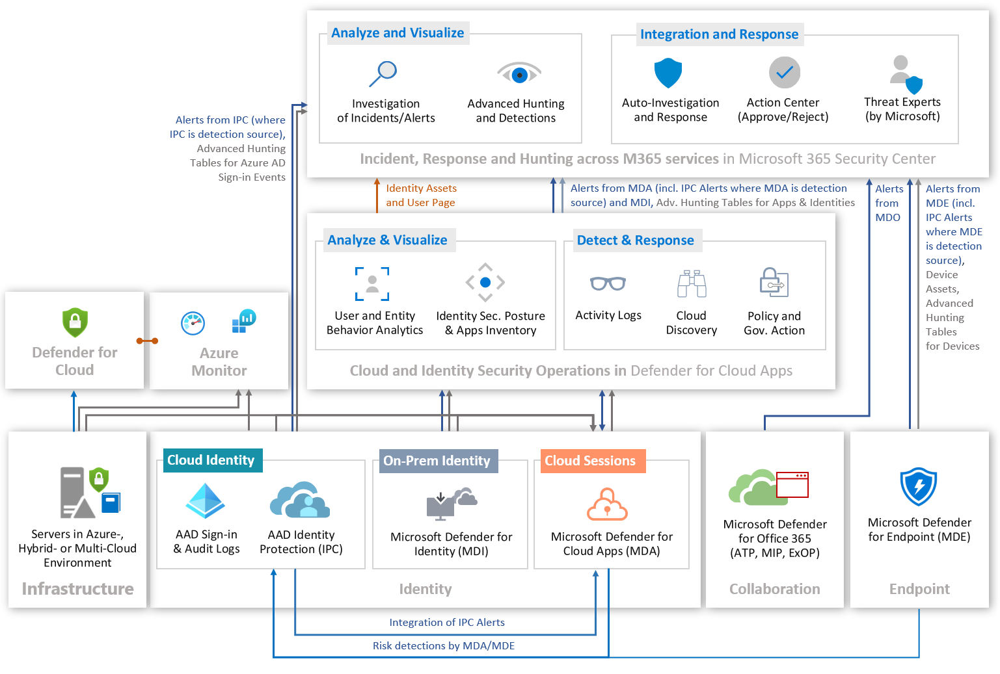

Microsoft 365 Defender (formerly "Microsoft Threat Protection") supports various services from the "M365 platform". Check the "[supported services](https://docs.microsoft.com/en-us/microsoft-365/security/mtp/deploy-supported-services?WT.mc_id=M365-MVP-5003945)" list to understand which data sources can be integrated. Start using "M365 Defender" is very easy by "[turn on](https://docs.microsoft.com/en-us/microsoft-365/security/mtp/mtp-enable?WT.mc_id=M365-MVP-5003945)" the described setting in the "Microsoft 365 Security Center".

*Note: Microsoft 365 Defender becomes the unified security portal for all Defender products. Nearly all features and options are available in the new security portal. Microsoft offers images and tables to [shows the changes between the navigation in the MDA and the M365D portal](https://learn.microsoft.com/en-us/microsoft-365/security/defender/microsoft-365-security-center-defender-cloud-apps?WT.mc_id=M365-MVP-5003945#quick-reference).* 

### Data Sources in "M365 Defender"

#### IaaS/PaaS (Cloud and on-Premises) and "M365 Defender"

Azure resource-level or collected logs by Azure Monitor are *not* covered by "M365 Defender".
Example: Event logs of Azure/Hybrid Servers or alerts from Microsoft Defender for Cloud are *not* visible for hunting in this portal. Nevertheless, Azure Activity Logs are part of the ["CloudAppEvents"](https://learn.microsoft.com/en-us/microsoft-365/security/defender/advanced-hunting-cloudappevents-table?WT.mc_id=M365-MVP-5003945&view=o365-worldwide) table if the App Connector to "Microsoft Azure" has been enabled in MDA.

#### Cloud Identity (Azure Active Directory) in "M365 Defender"

- [Incidents](https://docs.microsoft.com/en-us/microsoft-365/security/mtp/investigate-incidents?WT.mc_id=M365-MVP-5003945) /  [AlertInfo](https://docs.microsoft.com/en-us/microsoft-365/security/mtp/advanced-hunting-alertinfo-table?WT.mc_id=M365-MVP-5003945): All risk detections from "Azure AD Identity Protection" can be ingested as Alert (incl. correlation as "Incident") to the advanced hunting table [AlertInfo](https://docs.microsoft.com/en-us/microsoft-365/security/mtp/advanced-hunting-alertinfo-table?WT.mc_id=M365-MVP-5003945)" as part of the [IPC integration in M365 Defender](https://techcommunity.microsoft.com/t5/microsoft-365-defender-blog/identity-protection-alerts-are-coming-to-microsoft-365-defender/ba-p/3660997).
  - MDA feeds the configured (integration) type of alerts to "M365 Defender". MDA will be named as "ServiceSource" and "DetectionSource" for all IPC risk detections which has been detected by MDA. Microsoft has been integrated all identity alerts from Identity Protection to the unified security portal. This includes alerts which has been detected by MDA and IPC natively:
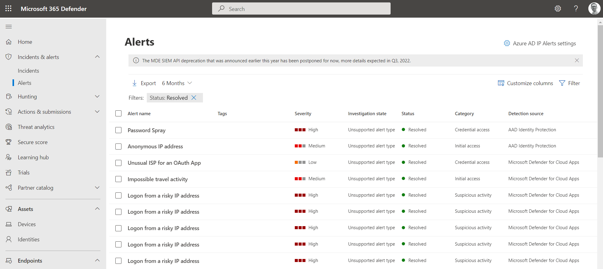
  - "Azure ID IP Alert Settings" in the alert blade of M365D Portal allows you to define the level of integration and scope.
  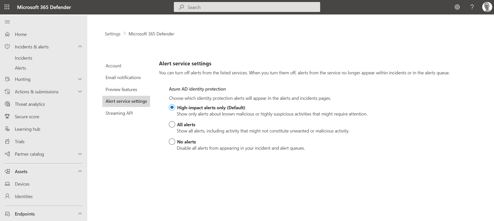

- [IdentityInfo:](https://docs.microsoft.com/en-us/microsoft-365/security/mtp/advanced-hunting-identityinfo-table?WT.mc_id=M365-MVP-5003945) Account information from various identity sources (including "Active Directory" and "Azure AD") will be stored here, to enable build relation between user objects (e.g. ObjectID, "On-Premises SID" and "Cloud SID"). Other details such as DisplayName, ProxyAddress or Account Status are also included.

- [IdentityLogonEvents](https://docs.microsoft.com/en-us/microsoft-365/security/mtp/advanced-hunting-identitylogonevents-table?WT.mc_id=M365-MVP-5003945): Authentication events captured by MDA will be stored in this table. This seems to covers only "sign-in events" to connected apps and are similar to the "Activity Logs" in the MDA blade (filtered by "Successful or failed login-ins"). As already described, "non-interactive" logons or sign-ins by "service principal"/"managed identity" are not included in this table yet.

- [Hunt for Azure Active Directory sign-in events](https://techcommunity.microsoft.com/t5/microsoft-365-defender/hunt-for-azure-active-directory-sign-in-events/ba-p/2040278):
Microsoft added the following tables to analyze interactive and non-interactive sign-ins. Both tables are being offered on "short-term" basis and will be eventually move to the IdentityLogonEvents table:

- [AADSpnSignInEventsBeta:](https://docs.microsoft.com/en-us/microsoft-365/security/mtp/advanced-hunting-aadspnsignineventsbeta-table?WT.mc_id=M365-MVP-5003945) Information about sign-ins from "Service Principals" and "Managed Identity" will be stored in this table. This feature is in "beta".

- [AADSignInEventsBeta:](https://docs.microsoft.com/en-us/microsoft-365/security/mtp/advanced-hunting-aadsignineventsbeta-table?WT.mc_id=M365-MVP-5003945) Interactive and non-interactive user sign-ins are available from this table.

- [CloudAppEvents:](https://docs.microsoft.com/en-us/microsoft-365/security/mtp/advanced-hunting-cloudappevents-table?WT.mc_id=M365-MVP-5003945) This table contains all streamed logs from the "Office 365 connector" in MDA which includes the [audit logs from "Azure AD" (in public preview)](https://techcommunity.microsoft.com/t5/microsoft-365-defender/azure-active-directory-audit-logs-now-available-in-advanced/ba-p/1999523?WT.mc_id=M365-MVP-5003945) as well. It seems that Azure AD logon events are not included.

#### On-Premises Identity (Active Directory) in "M365 Defender"

It's important to know that data of "Microsoft Defender for Identity" (MDI) will only be shown in the "M365 Defender" portal if the integration between MDA and MDI is enabled. MDA seems to be responsible to feeds the related MDI data to "M365 Defender". 

Correlation of MDI alerts with other activities and alerts from "M365 Defender" services (such as "Microsoft Defender for Endpoint") gives you [new capabilities](https://techcommunity.microsoft.com/t5/microsoft-security-and/microsoft-365-defender-enriches-the-microsoft-defender-for/ba-p/1808275?WT.mc_id=M365-MVP-5003945) to understand the context of Active Directory attacks. This becomes obvious if you think about the limited visibility of endpoint (threats) in MDA.
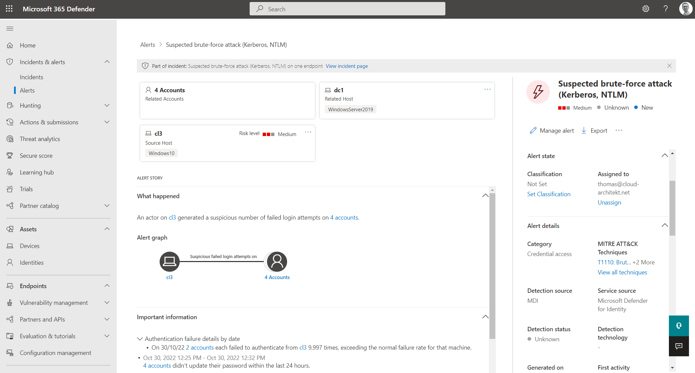
_The previous showed example of a brute-force attack will be also shown as alert in M365D including Alert graph and MITRE ATT&CK TTP mapping._

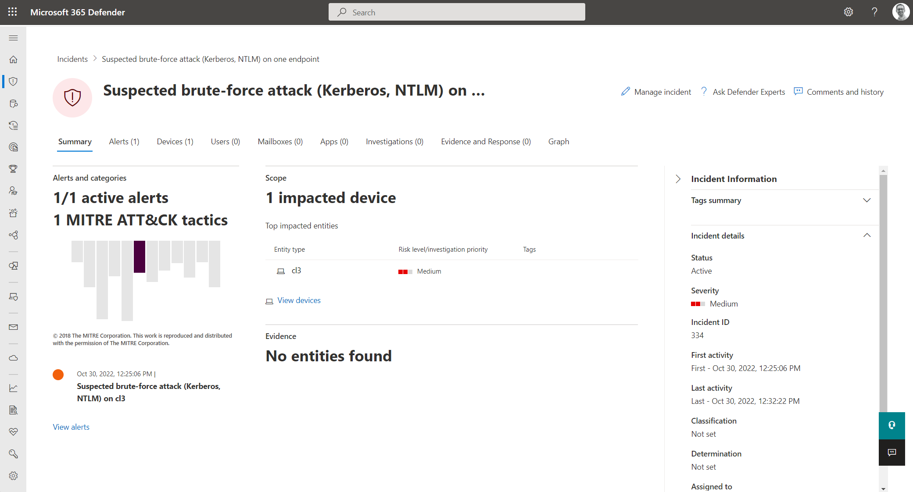

_But the alert will be also shown as incident and correlated with other alerts (if applicable) as multi-stage attack._

Recently, Microsoft added the opportunity to use "Advanced Hunting" based on [events captured by MDI](https://techcommunity.microsoft.com/t5/microsoft-365-defender/hunt-for-threats-using-events-captured-by-azure-atp-on-your/ba-p/1598212?WT.mc_id=M365-MVP-5003945). Another benefit (compared to MDI queries in the MDA portal):
Writing KQL queries for advanced hunting in "M365 Security Portal" by using the advanced logs from the following tables:

- [AlertInfo](https://docs.microsoft.com/en-us/microsoft-365/security/mtp/advanced-hunting-alertinfo-table?WT.mc_id=M365-MVP-5003945): Alerts from MDI will be stored in this table. AlertId includes the prefix "aa" (stands for Azure ATP?) followed by the original "AlertId" from the MDI portal (*not* the MDA AlertID!).

- [IdentityInfo:](https://docs.microsoft.com/en-us/microsoft-365/security/mtp/advanced-hunting-identityinfo-table?WT.mc_id=M365-MVP-5003945) As already described before, this table helps to correlate and build relation between various account objects. In this case, very helpful for advanced hunting and queries between "Azure AD" and "Active Directory" user objects.

- [IdentityLogonEvents](https://docs.microsoft.com/en-us/microsoft-365/security/mtp/advanced-hunting-identitylogonevents-table?WT.mc_id=M365-MVP-5003945): Authentication events to your "Active Directory" will be stored in this table. The logon events will be sourced from the connected MDI instance in MDA and shows similar results to a filtered "Activity Log" (by "Active Directory" app in the MDA portal). Various types of logon events in "Active Directory" are covered (including Remote Desktop, Interactive and Credentials validation via NTLM/Kerberos). Failure reason of "sign-in attempts" are also included (e.g. OldPassword).

- [IdentityQueryEvents](https://docs.microsoft.com/en-us/microsoft-365/security/mtp/advanced-hunting-identityqueryevents-table?WT.mc_id=M365-MVP-5003945): Queries on Active Directory objects (such as LDAP, DNS and SAMR) are collected from MDI in this table.

- [IdentityDirectoryEvents](https://docs.microsoft.com/en-us/microsoft-365/security/mtp/advanced-hunting-identitydirectoryevents-table?WT.mc_id=M365-MVP-5003945): This table contains many identity-related (on-premises) audit and system events from the domain controller. User-level auditing of password or group memberships are included but also "domain controller events" such as PowerShell execution, Task scheduling or potential lateral movement.
    - Custom detections can be created to [trigger an alert when a sensitive group membership change has made](https://techcommunity.microsoft.com/t5/security-compliance-and-identity/alert-when-a-group-is-added-to-a-sensitive-active-directory/ba-p/3436868?WT.mc_id=M365-MVP-5003945).

#### Cloud Sessions (Microsoft Defender for Cloud Apps) in "M365 Security"

Cloud Discovery and activity logs from connected apps are *not* available for hunting in "M365 Defender".

- [DeviceNetworkEvents](https://docs.microsoft.com/en-us/microsoft-365/security/mtp/advanced-hunting-devicenetworkevents-table?WT.mc_id=M365-MVP-5003945): As already described, "Microsoft Defender for Endpoints" (MDE) can be configured to forward signals to MDA (for "Cloud Discovery" and "Visibility of (un)sanctioned cloud apps"). This table helps to start queries on the raw logs from MDE.

#### Collaboration Platforms (Office 365 Services)
- [AlertInfo](https://docs.microsoft.com/en-us/microsoft-365/security/mtp/advanced-hunting-alertinfo-table?WT.mc_id=M365-MVP-5003945): Threat protection signals and data will be correlated from "Microsoft Defender for Office 365" (MDO) in M365 Defender. But it's limited to features and alerts around "Exchange Online" (such as "Safe Links" or Attachments).

Other Exchange Online-related logs and events are stored in the following tables and could be relevant for hunting of [phishing mails](https://docs.microsoft.com/en-us/windows/security/threat-protection/intelligence/phishing?WT.mc_id=M365-MVP-5003945):

- [EmailEvents](https://docs.microsoft.com/en-us/microsoft-365/security/mtp/advanced-hunting-emailevents-table?WT.mc_id=M365-MVP-5003945) (e-mail delivery and blocking events)
- [EmailAttachmentInfo](https://docs.microsoft.com/en-us/microsoft-365/security/mtp/advanced-hunting-schema-tables?WT.mc_id=M365-MVP-5003945) (file attachment)
- [EmailPostDeliveryEvents](https://docs.microsoft.com/en-us/microsoft-365/security/mtp/advanced-hunting-emailpostdeliveryevents-table?WT.mc_id=M365-MVP-5003945) (security event after e-mail delivery)
- [EmailUrlInfo](https://docs.microsoft.com/en-us/microsoft-365/security/mtp/advanced-hunting-emailurlinfo-table?WT.mc_id=M365-MVP-5003945) (URLs / Safe Attachment in E-Mails)

- [CloudAppEvents](https://docs.microsoft.com/en-us/microsoft-365/security/mtp/advanced-hunting-cloudappevents-table?WT.mc_id=M365-MVP-5003945): Activities from "Exchange Online" and "Microsoft Teams" (monitored by MDA) are available for hunting here. Other O365 services are not supported yet! OneDrive and SharePoint Online will be [introduced in early 2021](https://techcommunity.microsoft.com/t5/microsoft-365-defender/hunt-across-cloud-app-activities-with-microsoft-365-defender/ba-p/1893857?WT.mc_id=M365-MVP-5003945) and the existing "AppFileEvents" will be replaced at this time.

*Note: Interested in MDO? A great overview of the [threat protection features for Office 365](https://www.vansurksum.com/2020/04/29/office-365-advanced-threat-protection-atp-deep-dive/#Other-atp-functionality) is given by a deep dive blog post from Kenneth van Surksum.*

#### Device / Endpoint Security (Microsoft Defender for Endpoint) and "M365 Defender"

[Integration of "Microsoft Defender for Endpoint"](https://docs.microsoft.com/en-us/microsoft-365/security/mtp/deploy-supported-services?WT.mc_id=M365-MVP-5003945#limited-deployment-scenarios) (MDE) enables visibility on endpoint states, raw events, detections and alerts (which includes EDR/AV/attack surface reduction) and entities related to devices in M365 Defender.

- [AlertInfo](https://docs.microsoft.com/en-us/microsoft-365/security/mtp/advanced-hunting-alertinfo-table?WT.mc_id=M365-MVP-5003945): Alerts from MDE will be shown in this table. Other events from this source will be stored in the following tables:

- [DeviceEvents](https://docs.microsoft.com/en-us/microsoft-365/security/mtp/advanced-hunting-deviceevents-table?WT.mc_id=M365-MVP-5003945) (security controls such as AV or Exploit protection)
- [DeviceLogonEvents](https://docs.microsoft.com/en-us/microsoft-365/security/mtp/advanced-hunting-devicelogonevents-table?WT.mc_id=M365-MVP-5003945) (logon events on/to devices from local or (Azure) AD users)
- [DeviceInfo](https://docs.microsoft.com/en-us/microsoft-365/security/mtp/advanced-hunting-deviceinfo-table?WT.mc_id=M365-MVP-5003945) (similar to the approach of the table "IdentityInfo", helps to correlate or build relation based on meta information by devices)

M365 Defender provides a "[Device profile page](https://docs.microsoft.com/en-us/microsoft-365/security/mtp/device-profile?WT.mc_id=M365-MVP-5003945)" which is accessible from the "Incident" view. This gives you a unified control on M365 Defender- and MDE-related actions.

### Analyze and Visualize with "M365 Defender"

#### Monitoring and Reporting ("Cards" in M365 Security Home)

Dashboard of "Microsoft 365 Security Center" allows to add "cards" for summarized reports of various sections of security areas in "M365 Defender" (including "[identity monitoring and reporting](https://docs.microsoft.com/en-us/microsoft-365/security/mtp/monitor-and-report-identities?WT.mc_id=M365-MVP-5003945)").

#### Investigation of Incidents in "M365 Defender"

Incidents can be managed in the portal by [adding comments, adjusting priority](https://docs.microsoft.com/en-us/microsoft-365/security/mtp/manage-incidents?WT.mc_id=M365-MVP-5003945), [reporting false/positives](https://docs.microsoft.com/en-us/microsoft-365/security/mtp/mtp-autoir-report-false-positives-negatives?WT.mc_id=M365-MVP-5003945) or [checking related entities (devices/users) or alerts](https://docs.microsoft.com/en-us/microsoft-365/security/mtp/investigate-incidents?WT.mc_id=M365-MVP-5003945#incident-overview).

[Suspicious entities](https://docs.microsoft.com/en-us/microsoft-365/security/mtp/investigate-incidents?WT.mc_id=M365-MVP-5003945#evidence) are also stored in the table "[AlertEvidence](https://docs.microsoft.com/en-us/microsoft-365/security/mtp/advanced-hunting-alertevidence-table?WT.mc_id=M365-MVP-5003945)" which can be used for custom queries or advanced hunting.

#### Advanced Hunting in "M365 Defender"

As already described, "M365 Defender" supports hunting on query-based analytics (KQL) across the various tables from supported M365 services. This allows you easily to start [hunting between activities and alerts of devices, e-mails and identities](https://docs.microsoft.com/en-us/microsoft-365/security/mtp/advanced-hunting-query-emails-devices?WT.mc_id=M365-MVP-5003945).

#### Custom Detections with "M365 Defender"

Advanced Hunting queries can be used to create a "[Detection Rule](https://docs.microsoft.com/en-us/microsoft-365/security/mtp/custom-detection-rules?WT.mc_id=M365-MVP-5003945)" for alerting.
This gives you the ability to proactively monitor specific critical events or potential threats. Applicable actions can be triggered if an entity is founded in the query (for example: Isolate device in case of a "Brute Force" attack).

### Integration and Response in "M365 Defender"

#### Auto-Investigation and Response (AIR)

M365 Defender supports [remediation actions](https://docs.microsoft.com/en-us/microsoft-365/security/mtp/mtp-remediation-actions?WT.mc_id=M365-MVP-5003945) on suspicious or malicious "Devices", "Files" and "Emails" but also manual actions on "Users" (incl. confirm as compromised). Pending (if approval is needed/configured) or completed actions are visible and can be managed in the "[Action Center](https://docs.microsoft.com/en-us/microsoft-365/security/mtp/mtp-action-center?WT.mc_id=M365-MVP-5003945)". This incident response activities [follows after an automated investigation](https://docs.microsoft.com/en-us/microsoft-365/security/mtp/mtp-remediation-actions?WT.mc_id=M365-MVP-5003945) by M365 Defender.

[Automation level and scope for Endpoints](https://docs.microsoft.com/en-us/microsoft-365/security/mtp/mtp-configure-auto-investigation-response?WT.mc_id=M365-MVP-5003945#review-or-change-the-automation-level-for-device-groups) can be configured in the "Microsoft Defender Security Center" (MDE Portal). [Policies for Office 365 can be configured in the "M365 Security Center"](https://docs.microsoft.com/en-us/microsoft-365/security/mtp/mtp-configure-auto-investigation-response?WT.mc_id=M365-MVP-5003945#review-your-security-and-alert-policies-in-office-365).

#### Threat Experts

Advice by Microsoft's Threat Experts can be requested directly from the "Incident" view.
This is an additional service which can be [enrolled for a 90-day-trial or on-Demand subscription (by Microsoft)](https://docs.microsoft.com/en-us/windows/security/threat-protection/microsoft-defender-atp/microsoft-threat-experts#before-you-begin). 

### Considerations and References of "M365 Defender"

- [Microsoft 365 Defender Ninja Training](https://techcommunity.microsoft.com/t5/microsoft-365-defender/become-a-microsoft-365-defender-ninja/ba-p/1789376?WT.mc_id=M365-MVP-5003945) is a great resource to learn more!
- [Advanced Hunting Cheat Sheet](https://github.com/MiladMSFT/AdvHuntingCheatSheet/blob/master/MTPAHCheatSheetv01-light.pdf) gives some good samples and uses cases of queries across the supported services in "M365 Defender"
- [Samples of Advanced Hunting Queries](https://github.com/microsoft/Microsoft-365-Defender-Hunting-Queries) are available on GitHub and are ready to be used!
- Evaluate the "Attack Simulator" in the "M365 Security Center" to simulate attacks (such as phishing attacks) and start "security awareness" training for end-users
- Regular check on updates and changes in "[What's new in M365 Defender](https://docs.microsoft.com/en-us/microsoft-365/security/mtp/whats-new?WT.mc_id=M365-MVP-5003945)" or the message center in "Microsoft 365 admin center" is strongly recommended!
- Get an overview of the "M365 Defender" core features by [Microsoft's "educational training videos"](https://techcommunity.microsoft.com/t5/microsoft-365-defender/short-amp-sweet-educational-videos-on-microsoft-365-defender/ba-p/1525296?WT.mc_id=M365-MVP-5003945)
- Custom Detection Rules can be configured only with a frequency between 1-24 hours and  built-in action as auto-response
- [Default permissions](https://docs.microsoft.com/en-us/microsoft-365/security/mtp/mtp-permissions?WT.mc_id=M365-MVP-5003945) in "M365 Defender" should be considered (to know who has access)
- Take a look on the "[Interactive guide](https://mslearn.cloudguides.com/en-us/guides/Protect%20your%20organization%20with%20Microsoft%20Threat%20Protection)" to get an overview about the hunting and incident management capabilities
- [Microsoft 365 Defender trial lab](https://docs.microsoft.com/en-us/microsoft-365/security/mtp/mtp-evaluation?WT.mc_id=M365-MVP-5003945) can be helpful to simulate attacks and learn the ways to resolve incidents or start advanced hunting.
- [M365 Defender APIs](https://docs.microsoft.com/en-us/microsoft-365/security/mtp/api-overview?WT.mc_id=M365-MVP-5003945) are available which allows event streaming but also programmatically access to advanced hunting/queries and incidents.
    - Public preview of [Microsoft 365 Defender APIs are available in Microsoft Graph](https://techcommunity.microsoft.com/t5/microsoft-365-defender-blog/the-new-microsoft-365-defender-apis-in-microsoft-graph-are-now/ba-p/3603099?WT.mc_id=M365-MVP-5003945) which allows to get access to incident, alert and hunting data.
- John Barbare (Customer Engineer, Microsoft) has wrote a blog series about Incident Management in M365D. The articles are a good start to get familiar with the [Incidents Overview](https://techcommunity.microsoft.com/t5/core-infrastructure-and-security/microsoft-365-defender-incident-overview/ba-p/2174343) and [Investigation of an Incident](https://techcommunity.microsoft.com/t5/core-infrastructure-and-security/microsoft-365-defender-investigating-an-incident/ba-p/2205619?WT.mc_id=M365-MVP-5003945) in the new unified security portal.
- Consider which [MDA alerts are not imported into Microsoft Sentinel through Microsoft 365 Defender integration](https://docs.microsoft.com/en-us/azure/sentinel/microsoft-cloud-app-security-alerts-not-imported-microsoft-365-defender?WT.mc_id=M365-MVP-5003945) yet.

## Microsoft Sentinel: "Single pane of glass” across Azure, Microsoft 365 and 3rd party (cloud) platforms

*Sample use case: SecOps that needs a visibility across all "Microsoft Cloud services" (Azure and M365) and (Hybrid/On-Premises) infrastructure. Extended possibilities for customization of auto-response, integration of "3rd party security tools" or implementation custom detections are required. Microsoft Sentinel empowers SIEM capabilities as part of a cloud-native and integrated security solution by Microsoft. Longer data retention of logs and alerts, out-of-the-box detections and visualization are further advantages.*

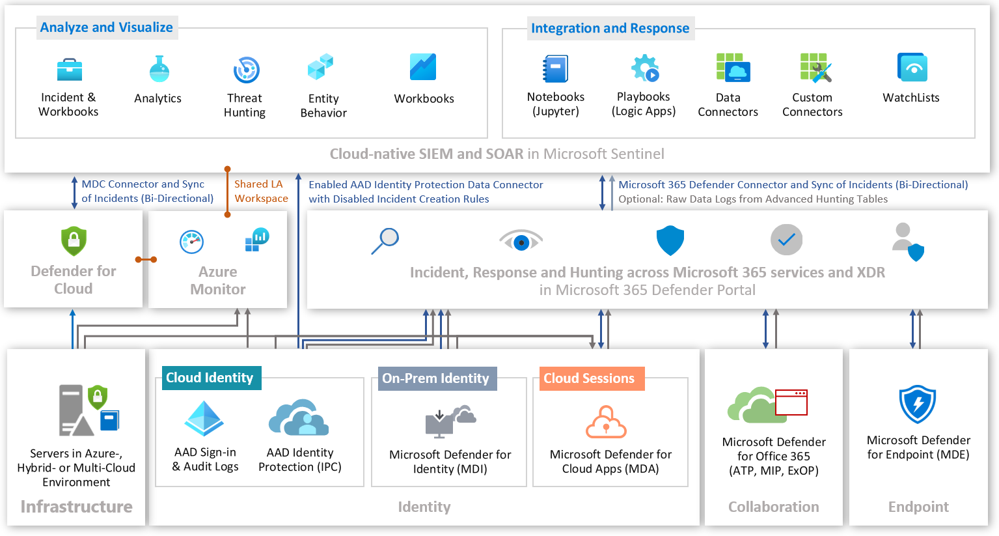
_Microsoft 365 Defender Incidents can be fully integrated with Microsoft Sentinel and offers a bi-directional sync. The unified connector will replace the previous single connector for MDE, MDI, MDO and MDA. In addition, advanced hunting tables can be ingested to Microsoft Sentinel._

### Data Sources of "Microsoft Sentinel"

All of the following data sources can be connected to "Microsoft Sentinel" by data connectors.
Alerts from the Microsoft Security products can be [created as "Incident" automatically](https://docs.microsoft.com/en-us/azure/sentinel/create-incidents-from-alerts?WT.mc_id=AZ-MVP-5003945) or offering already an incident creation by the data connector (e.g. M365 Defender Unified Connector). Incidents generated by this products will be stored in the "[SecurityIncident](https://docs.microsoft.com/en-us/azure/azure-monitor/reference/tables/securityincident?WT.mc_id=AZ-MVP-5003945)" table of the workspace.

Most of the following features can be used to visualize or extend the logs and alerts from data sources:

- KQL-based Dashboards ("[Workbooks](https://docs.microsoft.com/en-us/azure/sentinel/quickstart-get-visibility?WT.mc_id=AZ-MVP-5003945#use-built-in-workbooks)")
- KQL-based Detections ("[Analytic Rules](https://docs.microsoft.com/en-us/azure/sentinel/tutorial-detect-threats-built-in?WT.mc_id=AZ-MVP-5003945)") and [Hunting Queries](https://docs.microsoft.com/en-us/azure/sentinel/hunting?WT.mc_id=AZ-MVP-5003945#get-started-hunting)
- Logic Apps for automated response or integration ("[Playbooks](https://docs.microsoft.com/en-us/azure/sentinel/tutorial-respond-threats-playbook?WT.mc_id=AZ-MVP-5003945)")

*Note: Most of the KQL queries and dashboards are already integrated as "Templates" and available in your instance (right after the deployment).
Nevertheless, I have added the links to the GitHub repository where you can find the original source of the templates.*

*Note: Microsoft has published a unified "Microsoft 365 Defender" connector which allows one-click ingestion of all incidents (alerts and entities) from the M365 Security Portal into Microsoft Sentinel.
Furthermore the new connector allows bi-directional sync and streaming of all relevant information (advanced hunting tables) to Microsoft Sentinel. Detailed information about [the integration of M365 Defender and Microsoft Sentinel](https://docs.microsoft.com/en-au/azure/sentinel/microsoft-365-defender-sentinel-integration) are available in Microsoft Docs.
Consider side effects of duplicated incidents if both connector (component alert connector of single M365 Defender services and the unified M365 Data Connector) are enabled at the same time. The new connector improves the integration between Microsoft Sentinel and M365D by a seamless experience for responding to security threats for SecOps. Streaming (mostly all) advanced hunting event collection from M365D to Microsoft Sentinel is another great benefit.*

### IaaS/PaaS (Cloud and on-Premises) in "Microsoft Sentinel"

Microsoft Sentinel is built and will be deployed on "top of" Log Analytics Workspaces.
Collection of security and audit logs from "Azure Resources" or servers (On-Premises or hosted by "3rd Party Cloud Providers") can be implemented, alongside of the previously described "Azure Monitor (Logs)" integration. Microsoft Sentinel offers some "data connectors" to easily integrate the following data sources:

- [Data from "Azure Activity Logs"](https://docs.microsoft.com/en-us/azure/sentinel/connect-azure-activity): Selected subscriptions will stream their platform logs to the table "[AzureActivity](https://docs.microsoft.com/en-us/azure/azure-monitor/reference/tables/azureactivity)".
    - Insights of all operations and events within the "connected subscriptions" will be visualized by the built-in "Azure Activity" workbook. This gives you an overview about detected failures, warnings and caller activities to the "Azure Platform".
    - Eight different analytic rules are available for this "data source" including detection of anomalous privileged access such as "[Suspicious Resource Deployment or granting of permission](https://github.com/Azure/Azure-Sentinel/tree/master/Detections/AzureActivity)"
    - Security-related "diagnostic logs" should be also forwarded to the workspace of Microsoft Sentinel. It allows you to use "Analytic rules" for detecting unfamiliar access activities e.g. [in "Azure Key Vault" (mass secret retrieval or sensitive operations)](https://github.com/Azure/Azure-Sentinel/tree/master/Detections/AzureDiagnostics).
    - Other Cloud Providers: [Amazon Web Services (AWS)](https://docs.microsoft.com/en-us/azure/sentinel/connect-aws?WT.mc_id=AZ-MVP-5003945) can be integrated to stream all "Management Events" to Microsoft Sentinel as well.
- Data from [Syslog](https://docs.microsoft.com/en-us/azure/sentinel/connect-syslog) / [Security Event](https://docs.microsoft.com/en-us/azure/sentinel/connect-windows-security-events?WT.mc_id=AZ-MVP-5003945) Logs: This allows you to collect all security events from Windows and Linux machines by the "Log Analytics Agent" or "Azure Monitor Agent". Scope configuration of streamed events can be configured as previously described in this article. This settings also defines the amount and scope of "raw logs" that will be stored in the tables "[SecurityEvent](https://docs.microsoft.com/en-us/azure/azure-monitor/reference/tables/securityevent?WT.mc_id=AZ-MVP-5003945)" (Log Analytics Agent), "[WindowsEvents](https://learn.microsoft.com/en-us/azure/azure-monitor/reference/tables/windowsevent?WT.mc_id=AZ-MVP-5003945)" (Azure Monitor Agent) and "[Syslog](https://docs.microsoft.com/en-us/azure/azure-monitor/reference/tables/syslog?WT.mc_id=AZ-MVP-5003945)".
    - Microsoft Sentinel includes "analytic rules" to detect [failed logon attempts or "Brute Force" attacks](https://github.com/Azure/Azure-Sentinel/tree/master/Detections/Syslog) to your Linux servers. But also many [detections for user management or (RDP) sign-in anomaly](https://github.com/Azure/Azure-Sentinel/tree/master/Detections/SecurityEvent) on Windows Servers are available.
    - Microsoft Sentinel provides  [ML-based behavior analytics to detect anomalous logins via SSH and RDP](https://techcommunity.microsoft.com/t5/azure-sentinel/what-s-new-azure-sentinel-machine-learning-behavior-analytics/ba-p/1521988?WT.mc_id=M365-MVP-5003945).
    - Many workbooks are available to visualize the raw logs from servers in your environment including "[Event Analyzer](https://github.com/Azure/Azure-Sentinel/blob/master/Workbooks/EventAnalyzer.json)"(for audit object, file system or registry of Windows) or "[Linux Machines](https://github.com/Azure/Azure-Sentinel/blob/master/Workbooks/LinuxMachines.json)" (for insights of Linux events and errors).

### Microsoft Defender for Cloud and Microsoft Sentinel

[Alert Data from Microsoft Defender for Cloud:](https://docs.microsoft.com/en-us/azure/sentinel/connect-azure-security-center?WT.mc_id=AZ-MVP-5003945) This connector allows to ingest alerts of detected threats by MDC. The alerts will be found in the "[SecurityAlert](https://docs.microsoft.com/en-us/azure/azure-monitor/reference/tables/securityalert?WT.mc_id=AZ-MVP-5003945)" table as ProviderName "Azure Security Center". 

- Microsoft Sentinel includes a [unified workbook to get compliance, posture management and protection status](https://techcommunity.microsoft.com/t5/azure-sentinel/gain-compliance-posture-and-protection-insights-with-this-azure/ba-p/1290454?WT.mc_id=M365-MVP-5003945) (including trends) on your "Azure Security Center" data.
- Playbooks allows you to [connect new "Azure Subscriptions" automatically](https://github.com/Azure/Azure-Sentinel/tree/master/Playbooks/AutoConnect-ASCSubscriptions) on a scheduled basis or to automate the notification of [incidents (to RBAC assigned Owners)](https://github.com/Azure/Azure-Sentinel/tree/master/Playbooks/Notify-ASCAlertAzureResource) or [recommendation (incl. IAM configuration) of resources](https://github.com/Azure/Azure-Sentinel/tree/master/Playbooks/Get-ASCRecommendations).

### Cloud Identity (Azure Active Directory) in "Microsoft Sentinel"

[Data from Azure AD Logs](https://docs.microsoft.com/en-us/azure/sentinel/connect-azure-active-directory?WT.mc_id=AZ-MVP-5003945): Data connector is configuring and using "[diagnostic settings](https://docs.microsoft.com/en-us/azure/active-directory/reports-monitoring/howto-integrate-activity-logs-with-log-analytics#send-logs-to-azure-monitor?WT.mc_id=AZ-MVP-5003945)" to gather all insights of sign-in events to the workspace of Microsoft Sentinel. The following assets can be deployed as part of the content hub solution "Azure Active Directory":

_Content hub solution for Azure AD can be used to deploy the related built-in analytics rule, workbooks and playbooks._

- Many [KQL queries (analytic rules) are able to detect malicious activities such as "OAuth app" registrations](https://github.com/Azure/Azure-Sentinel/tree/master/Detections/AuditLogs). Analyses of sign-in attempts supports you to find [initial access attacks such as brute force to Azure Portal or Azure AD PowerShell anomalies](https://github.com/Azure/Azure-Sentinel/tree/master/Detections/Syslog).
- Many hunting queries related to Azure AD "[Audit](https://github.com/Azure/Azure-Sentinel/tree/master/Hunting%20Queries/AuditLogs)" or "[Sign-in](https://github.com/Azure/Azure-Sentinel/tree/master/Hunting%20Queries/SigninLogs)" logs are available and empowers "Security Analysts" to detect e.g. anomalous activities in "account creation", "login to devices", "role assignments" or "rare privileged account activity". Hunting queries using multiple data sources alongside of Azure AD logs such as "Azure Activity Logs" or the "Behavior Analytics" from Microsoft Sentinel.
- Different kind of workbooks for "Azure AD" are included as "templates" for visualization. Insights about Azure AD-related logs will be visualized or partly included in combined views in other workbooks.

    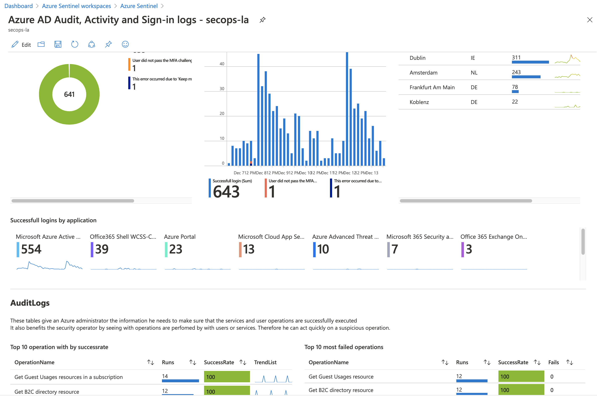
    *This workbook shows unified events between activity logs from Azure but also audit and sign-ins logs from Azure AD.*

- Auto-response on detected identity risks or threat detections can be extended by Playbooks. Microsoft offers samples for many actions such as [isolate VM by using Network Security Group)](https://github.com/Azure/Azure-Sentinel/tree/master/Playbooks/Isolate-AzureVMtoNSG) or [revoke the sign-in session (token) by Microsoft Graph API](https://github.com/Azure/Azure-Sentinel/tree/master/Playbooks/Revoke-AADSignInSessions).

[Security Alerts from "Azure AD Identity Protection"](https://docs.microsoft.com/en-us/azure/sentinel/connect-cloud-app-security): All risk detection will be stored in the "[SecurityAlert](https://docs.microsoft.com/en-us/azure/azure-monitor/reference/tables/securityalert)" table under ProviderName "IPC" (= Identity Protection) by using this connector.

- Advanced correlation between incidents of [unfamiliar and atypical detections](https://github.com/Azure/Azure-Sentinel/tree/master/Detections/SecurityAlert) are possible with analytic rules.
- Status management of risky users ([confirm](https://github.com/Azure/Azure-Sentinel/tree/master/Playbooks/Confirm-AADRiskyUser) or [dismiss](https://github.com/Azure/Azure-Sentinel/tree/master/Playbooks/Dismiss-AADRiskyUser)) can be automated by Playbooks.

### On-Premises Identity (Active Directory) in "Microsoft Sentinel"

[Alerts from Microsoft Defender for Identity (MDI)](https://docs.microsoft.com/en-us/azure/sentinel/connect-azure-atp?WT.mc_id=AZ-MVP-5003945): Connector is listed as "Microsoft Defender for Identity (Preview)" and forward the alerts to the "[SecurityAlert](https://docs.microsoft.com/en-us/azure/azure-monitor/reference/tables/securityalert?WT.mc_id=AZ-MVP-5003945)" table ("ProviderName" is named like the previously product name). I can strongly recommend to use the  ["Microsoft 365 Defender" connector](https://techcommunity.microsoft.com/t5/azure-sentinel/what-s-new-microsoft-365-defender-connector-now-in-public/ba-p/1865651) which offers bi-directional sync and also the option to ingest raw or detailed logs from MDI to Microsoft Sentinel.

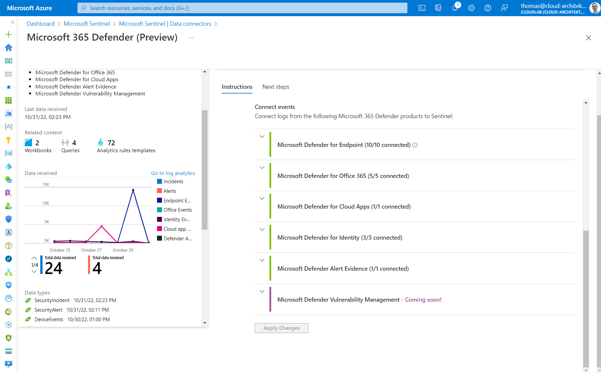

*"Microsoft 365 Defender" connector allows to stream the already known "Advanced hunting" tables (with raw event data) from the "M365 Security Portal" to Microsoft Sentinel. This is available for all M365D services excluding Vulnerability Management.*

Collected (security) logs from domain controllers (via Log Analytics Agent or Azure Monitor Agent) can be used to gain insights of the on-premises environment. Workbooks to analyze security events to [detect usage of insecure protocols (NTLMv1, WDigest)](https://techcommunity.microsoft.com/t5/azure-sentinel/azure-sentinel-insecure-protocols-workbook-reimagined/ba-p/1558375?WT.mc_id=M365-MVP-5003945) or visualize anomalies and user activities across "Identity & Access" operations are available.

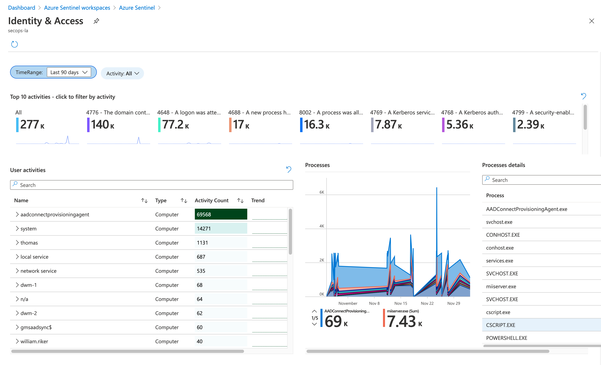
*Workbook template "Identity & Access" uses logs from the "SecurityEvents" table to visualize authentication events and user activities in your "Active Directory" environment.*

### Cloud Sessions (Microsoft Defender for Cloud Apps) in "Microsoft Sentinel"

[Data from Defender for Cloud Apps](https://docs.microsoft.com/en-us/azure/sentinel/connect-cloud-app-security?WT.mc_id=AZ-MVP-5003945): All alerts from MDA will be stored in the table "[SecurityAlert](https://docs.microsoft.com/en-us/azure/azure-monitor/reference/tables/securityalert?WT.mc_id=AZ-MVP-5003945)". The second data type of the connector collects the "Discovery Log" ("Shadow IT" reports) from MDA to the "[McasShadowItReporting](https://learn.microsoft.com/en-us/azure/azure-monitor/reference/tables/mcasshadowitreporting?WT.mc_id=AZ-MVP-5003945)" table in the Sentinel workspace.
It's strongly recommended to use the "[Microsoft 365 Defender Connector](https://learn.microsoft.com/en-us/azure/sentinel/microsoft-365-defender-sentinel-integration)" which offers you (in addition) bi-directional sync and options to ingest advanced hunting table of CloudAppEvents to MicrosoftSentinel.

- Microsoft Sentinel integration will be also [configured in the "MDA portal"](https://docs.microsoft.com/en-us/cloud-app-security/siem-sentinel) and allows to specify filters on the discovery logs.
- [Data schema of the MDA logs](https://docs.microsoft.com/en-us/cloud-app-security/siem-sentinel#alerts-and-discovery-logs-in-azure-sentinel) in Microsoft Sentinel are also documented by Microsoft.
- Discovery Logs in Microsoft Sentinel can be visualized by using the [pre-configured "Workbook"](https://github.com/Azure/Azure-Sentinel/blob/45310fe6be3cb30cbd8f073443a0c2f9144115fa/Workbooks/MicrosoftCloudAppSecurity.json) template.
- Resolving MDA alerts can be automated as part of Playbook (instead of PowerAutomate) in Microsoft Sentinel.
    - Example:  [Closing alert of "Infrequent Country"](https://github.com/Azure/Azure-Sentinel/tree/master/Playbooks/Resolve-MCASInfrequentCountryAlerts) if affected users meet a criteria such as "out-of-office status" or "group membership" (employees who travel internationally). Details of this example are very well [explained by Sebastian Molendijk in his video](https://www.youtube.com/watch?v=ql8x4rC6m9A).

### Collaboration Platforms (Office 365 Services) in "Microsoft Sentinel"

[Data from Office 365 Logs](https://docs.microsoft.com/en-us/azure/sentinel/connect-office-365?WT.mc_id=AZ-MVP-5003945): Activity logs from SharePoint, Exchange and Teams will be stored in the "[OfficeActivity](https://docs.microsoft.com/en-us/azure/azure-monitor/reference/tables/officeactivity?WT.mc_id=AZ-MVP-5003945)" table by this connector.

- User activities by these three workloads can be visualized in the ["Office 365" workbook](https://github.com/Azure/Azure-Sentinel/blob/master/Workbooks/Office365.json).
- Many analytic rules are available [to detect suspicious "Office 365" activities](https://github.com/Azure/Azure-Sentinel/tree/master/Detections/OfficeActivity) but also some hunting queries on [Exchange Online mailboxes, SharePoint downloads](https://github.com/Azure/Azure-Sentinel/tree/master/Hunting%20Queries/OfficeActivity) or [Teams activities](https://github.com/Azure/Azure-Sentinel/tree/master/Hunting%20Queries/TeamsLogs) are available.
- Other compliance, operational or security logs from "Office 365" (such as Message Trace logs) are *not* included. Collecting the missing logs are described in a [TechCommunity blog post and will be achieved trough Azure Logic Apps](https://techcommunity.microsoft.com/t5/azure-sentinel/how-to-protect-office-365-with-azure-sentinel/ba-p/1656939?WT.mc_id=M365-MVP-5003945).

[Alerts from "Microsoft Defender for Office 365" (MDO)](https://docs.microsoft.com/en-us/azure/sentinel/connect-office-365-advanced-threat-protection?WT.mc_id=AZ-MVP-5003945): Data connector is named as new product name "Microsoft Defender for Office 365 (Preview)" (MDO) and allows to store many types of alerts from the "Office Security and Compliance Center"  to the "[SecurityAlert](https://docs.microsoft.com/en-us/azure/azure-monitor/reference/tables/securityalert?WT.mc_id=AZ-MVP-5003945)" table. Advanced logs (data) and all types of alerts from MDO can be ingested by using "[M365 Defender Connector](https://docs.microsoft.com/en-us/azure/sentinel/connect-microsoft-365-defender)" which includes also tables such as EmailEvents and UrlClickEvents.

### Device / Endpoint Security (Microsoft Defender for Endpoint) in "Microsoft Sentinel"

[Alerts from "Microsoft Defender for Endpoint" (MDE)](https://docs.microsoft.com/en-us/azure/sentinel/connect-microsoft-defender-advanced-threat-protection?WT.mc_id=AZ-MVP-5003945): Data connector to fetch alerts generated by endpoint protection is available under the new product name "Microsoft Defender for Endpoint" (MDE). Alerts will be also stored (similar to the other M365 Defender products) in the "[SecurityAlert](https://docs.microsoft.com/en-us/azure/azure-monitor/reference/tables/securityalert?WT.mc_id=AZ-MVP-5003945)" table.

- Many [playbooks](https://github.com/Azure/Azure-Sentinel/tree/master/Playbooks) are available from Microsoft to use MDE to restrict entities (block IP address, URL, app execution,...) or further interaction (get investigation package or list of the Threat & Vulnerability Management) as part of an automated response process.

[Data from M365 Defender (Device*)](https://docs.microsoft.com/en-us/azure/sentinel/connect-microsoft-365-defender?WT.mc_id=AZ-MVP-5003945): Advanced logs from the already known "advanced hunting" tables (DeviceInfo, DeviceLogonEvents,...) in "M365 Defender" will be streamed to "Microsoft Sentinel" by the unified connector.

- This allows new hunting and correlation options between logs that can be only collected from Azure Monitor/Microsoft Sentinel and M365 integrated logs.
    - Example: "Windows Sign-in events" ("SigninLogs" table, sourced from Azure AD) can be correlated natively with entries of the "DeviceLogonEvents" table which covers local sign-in and authentication events from MDE.
- M365 Defender and Microsoft Sentinel are using KQL as query language. Therefore all your existing hunting queries from MDE/M365 Defender should be easily used in Microsoft Sentinel as well.

## Investigation of Incidents in "Microsoft Sentinel"

### Incidents and Workbooks in "Microsoft Sentinel" blade

Incidents blade of "Microsoft Sentinel" shows all alerts from the "connected data sources" in Microsoft Sentinel. This includes MDA "custom alerts" (e.g. activity policy "Elevated Global Admin to Azure Management") and all other built-in policies or detections (e.g. "Mass Download by a single user" in MDA). But also alerts from "Microsoft Defender for Cloud" ("Access from a Tor exit") and "Analytic rules" (from Microsoft Sentinel) on Azure Activity Logs ("Rare subscription-level operations") will be listed.

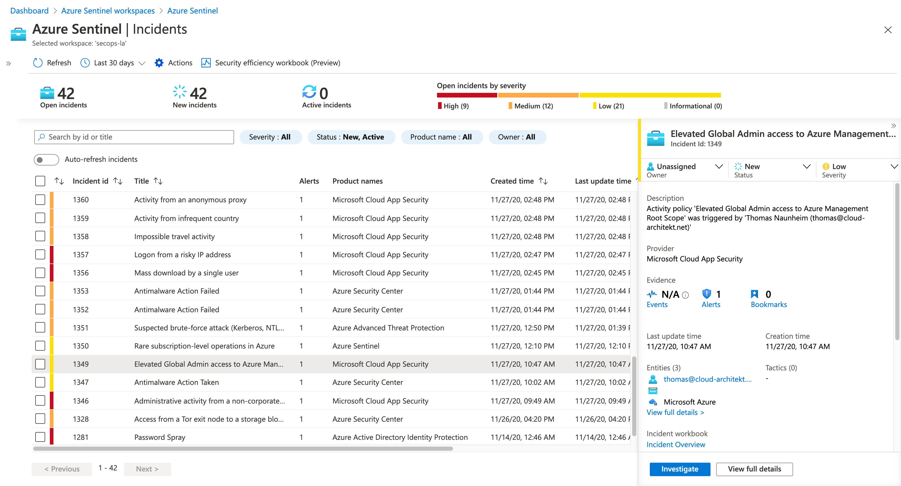

It's important to understand the difference between incident and alerts in Microsoft Sentinel:
Incidents are a group of related alerts and will be correlated by Microsoft Sentinel.

- As already described, alerts from connected security products (MDE, MDI, MDC, etc.) are only displayed as "Incident" if "[Microsoft Security Incident Creation Analytic Rules](https://docs.microsoft.com/en-us/azure/sentinel/create-incidents-from-alerts?WT.mc_id=AZ-MVP-5003945)" are configured in the "Analytics" blade.
- Built-in (templates) or custom analytic rules can be grouped as "Incident" if an alert is triggered (enabled by default).

It is also important to know the [different types of analytic rules](https://docs.microsoft.com/en-us/azure/sentinel/tutorial-detect-threats-built-in?WT.mc_id=AZ-MVP-5003945#about-out-of-the-box-detections) and the logic behind them.

Templates of various workbooks are included that gives you an advanced view of incidents:

- [Incident Overview](https://github.com/Azure/Azure-Sentinel/blob/master/Workbooks/IncidentOverview.json) (In-depth information to a specific incident case)
- [Investigation Insights](https://github.com/Azure/Azure-Sentinel/blob/master/Workbooks/InvestigationInsights.json) (timeline and trend of incidents combined with detailed information about entities)
- [MITRE ATT&CK](https://github.com/Azure/Azure-Sentinel/blob/master/Workbooks/MITREAttack.json) (Visualizing coverage of "MITRE ATT&CK" framework on Microsoft Sentinel)

### Investigation Graph

Investigation between security events based on "device" or "user" detections but also from "cloud" or "on-premises" resources can be hard. Sentinel offers a visualization of raw data and timeline to increase the visibility of context and helps to start your investigation on relation between entities of the incidents.
Therefore, [Investigation graph](https://docs.microsoft.com/en-us/azure/sentinel/tutorial-investigate-cases?WT.mc_id=AZ-MVP-5003945) can be very useful for investigate your incidents.

Recently, Microsoft introduced the "[Entity Insights](https://techcommunity.microsoft.com/t5/azure-sentinel/what-s-new-entity-insights-for-convenient-investigation-checks/ba-p/1801496?WT.mc_id=M365-MVP-5003945)" feature which shows detailed information of the related entities in the "investigation graph".

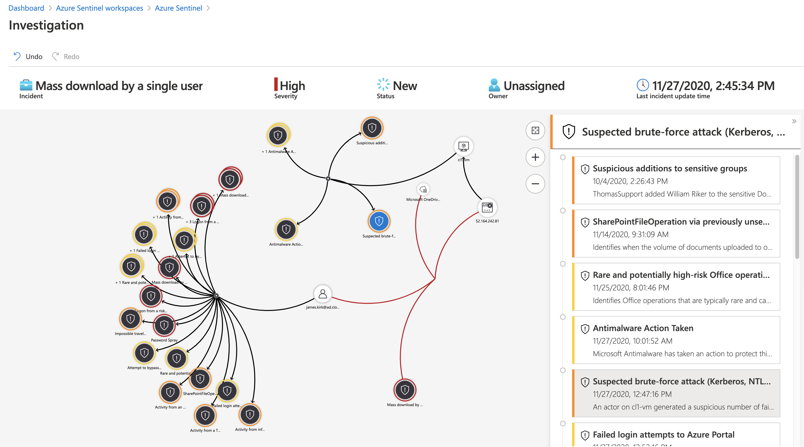

*Investigation starts on "Mass Download" incident and exploring all other related alerts from the entities. At the end, a comprehensive attack timeline and visualized progression of events will be shown. Detections of "Brute-Force" against "Active Directory" and the "Azure Portal" can be analyzed in the one investigation step.* 

### Advanced multistage attack detection

[Advanced multistage attack detection](https://docs.microsoft.com/en-us/azure/sentinel/fusion?WT.mc_id=AZ-MVP-5003945) is based on machine learning (["Fusion" technology](https://www.microsoft.com/security/blog/2020/02/20/azure-sentinel-uncovers-real-threats-hidden-billions-low-fidelity-signals/)) and automates the correlation on various types of attack scenarios. This includes data exfiltration, lateral movement and malicious administrative activities. 

*Fusion detects a multistage attack and build an incident with collections of related alerts.*

### Entity Behavior

[User Entity Behavior Analytics (UEBA)](https://techcommunity.microsoft.com/t5/azure-sentinel/guided-ueba-investigation-scenarios-to-empower-your-soc/ba-p/1857100?WT.mc_id=M365-MVP-5003945) allows investigation of entities (such as user or devices) and their behavior based on Microsoft Sentinel data.

- Onboarded data sources and their raw data will be analyzed by the "UEBA Engine" in Microsoft Sentinel to find anomalies.
- User information will be synchronized from "Azure AD" to enrich user profiles in the UEBA entity pages.
- Details on the architecture and engine to [identify advanced threats with this feature](https://docs.microsoft.com/en-us/azure/sentinel/identify-threats-with-entity-behavior-analytics) are documented by Microsoft.

UEBA can be [enabled](https://docs.microsoft.com/en-us/azure/sentinel/enable-entity-behavior-analytics) from the "Entity behavior" blade in Microsoft Sentinel.
Selection of data sources (used by UEBA) can also be configured in this blade and includes "Azure AD" (Audit / Sign-in logs), "Active Directory", "Azure Activity" and "Security Events" (from all connected Microsoft Security products). Scoring and timeline of the "Entity pages" are longer visible in comparison with the MDA "user page".

Microsoft has been released also a solution which allows to use [UEBA data as part of hunting query](https://techcommunity.microsoft.com/t5/microsoft-sentinel-blog/ueba-essentials-solution-now-available-in-content-hub/ba-p/3651074?WT.mc_id=AZ-MVP-5003945).

Enriched events from the "UEBA engine" will be stored in the "[BehaviorAnalytics](https://docs.microsoft.com/en-us/azure/azure-monitor/reference/tables/behavioranalytics?WT.mc_id=AZ-MVP-5003945)" table and are readable as (table) entries [by using KQL queries](https://docs.microsoft.com/en-us/azure/sentinel/identify-threats-with-entity-behavior-analytics?WT.mc_id=AZ-MVP-5003945#querying-behavior-analytics-data). Microsoft is also using this table to visualize "UEBA results" in the workbook template "[User And Entity Behavior Analytics](https://github.com/Azure/Azure-Sentinel/blob/master/Workbooks/UserEntityBehaviorAnalytics.json)". The founded anomalies will be scored with "Investigation Priority Score" and mapped to the "MITRE ATT&CK" framework.

Analytics from "UEBA" based on accounts, IP addresses and hosts entities can be displayed in the "Entity behavior" blade.

*Entity pages shows an "Alerts and Activities Timeline" with all incidents by "Microsoft Security products" (generated by incident creation rule) or analytic rules (built-in or custom queries) and anomalous detections based on the behavioral learning in" UEBA". Insight box visualize anomalous activities and sign-in events from the various data sources.*

### Hunting Queries
Over hundreds of [hunting queries](https://docs.microsoft.com/en-us/azure/sentinel/hunting) are already integrated and can be used by "Security Analysts" to start hunting on various types of threats incl. "initial access" or "privilege escalation". The list of hunting queries can be filtered by "data sources" and "tactics". All queries are written in KQL and can be edited or customized.
New hunting queries can be created from the blade and Microsoft is [adding new "out of the box" queries](https://techcommunity.microsoft.com/t5/azure-sentinel/what-s-new-80-out-of-the-box-hunting-queries/ba-p/1892067?WT.mc_id=M365-MVP-5003945) on a regular basis.

## Integration and Response in "Microsoft Sentinel"

### Playbooks

A logic app can be triggered to automate "threat response" when an "analytic rule" generates the alert.
All logic apps that includes "Microsoft Sentinel alert trigger" can be used as "Playbook".
Microsoft describes the configuration of this playbooks in one of the [Microsoft Sentinel tutorials](https://docs.microsoft.com/en-us/azure/sentinel/tutorial-respond-threats-playbook?WT.mc_id=AZ-MVP-5003945).
As already mentioned, many logic app templates are available from [GitHub](https://github.com/Azure/Azure-Sentinel/tree/master/Playbooks).
Monitoring of playbooks is an important part of daily operations (especially if it's an essential part of your incident and response process). [Workbook for "Playbook Health"](https://techcommunity.microsoft.com/t5/azure-sentinel/what-s-new-monitoring-your-logic-apps-playbooks-in-azure/ba-p/1873211?WT.mc_id=M365-MVP-5003945) might be helpful to get an overview about failed runs and latency.

In addition, there is also a ["Logic App connector" for Microsoft Sentinel](https://docs.microsoft.com/en-us/connectors/azuresentinel/) which allows to update or use information from incidents.

### WatchList

Microsoft has introduced [Watchlist](https://docs.microsoft.com/en-us/azure/sentinel/watchlists?WT.mc_id=AZ-MVP-5003945) as feature to collect data from "external sources" for correlation in the analytic rules. [Items of the WatchList can be updated by a Logic App](https://techcommunity.microsoft.com/t5/microsoft-sentinel-blog/new-watchlist-actions-available-for-watchlist-automation-using/ba-p/3297851). Various [WatchList templates](https://learn.microsoft.com/en-us/azure/sentinel/watchlist-schemas) are available to identify sensitive resources like service accounts or VIP users and building identity correlation (between multiple accounts).

### Notebooks

Microsoft Sentinel allows to use "Jupyter notebooks" running on "Azure Machine Learning" (AML) platform and using "Microsoft Sentinel" data. Notebook templates are already included such as an "[Entity Explorer for Account](https://github.com/Azure/Azure-Sentinel-Notebooks/blob/master/Entity%20Explorer%20-%20Account.ipynb)" or "[guided hunting on anomalous Exchange Online Sessions](https://github.com/Azure/Azure-Sentinel-Notebooks/blob/master/Guided%20Investigation%20-%20Anomaly%20Lookup.ipynb)".

Notebook are very powerful for [hunting of security threats](https://docs.microsoft.com/en-us/azure/sentinel/notebooks?WT.mc_id=AZ-MVP-5003945) and allows [enhancement of existing "Microsoft Sentinel data" by external threat intelligence](https://techcommunity.microsoft.com/t5/azure-sentinel/security-investigation-with-azure-sentinel-and-jupyter-notebooks/ba-p/432921?WT.mc_id=M365-MVP-5003945).

## Considerations and References of "Microsoft Sentinel"

- [Microsoft Sentinel Ninja (Level 400)](https://techcommunity.microsoft.com/t5/azure-sentinel/become-an-azure-sentinel-ninja-the-complete-level-400-training/ba-p/1246310?WT.mc_id=M365-MVP-5003945) Training includes a great list of resources to start your study on Microsoft's SIEM solution.
- Currently there are 3 different ways and "agents" (Log Analytics Agent, Azure Monitior Agent and MDI) to get security logs from Active Directory Domain Controllers. It's strongly recommend to review the data coverage for this servers:
        - [Monitoring Active Directory with Microsoft Sentinel – the agent deep dive (by Matt Zorich)](https://learnsentinel.blog/2022/04/12/monitoring-active-directory-with-microsoft-sentinel-the-agent-deep-dive/)
- Microsoft is offering many interesting webinars around Microsoft Sentinel! Check out the [upcoming events or the records of the past webinars](https://techcommunity.microsoft.com/t5/microsoft-security-and/security-community-webinars/ba-p/927888?WT.mc_id=M365-MVP-5003945).
    - One of my favourite session is "[Tackling Identity](https://www.youtube.com/watch?v=BcxiY32famg)" because of the high proportion of use cases and live-demos (KQL samples) that shows the advantages and technical possibilities of Microsoft Sentinel.
- Consider [Microsoft's Best Practices for Microsoft Sentinel](https://www.microsoft.com/security/blog/wp-content/uploads/2020/07/Azure-Sentinel-whitepaper.pdf)
    - Best Practices for [designing Microsoft Sentinel and Azure Security Center workspaces](https://techcommunity.microsoft.com/t5/azure-sentinel/best-practices-for-designing-an-azure-sentinel-or-azure-security/ba-p/832574?WT.mc_id=M365-MVP-5003945) is very important!
    - Consider to create as few workspaces as possible!
- [Microsoft Sentinel To-Go](https://techcommunity.microsoft.com/t5/azure-sentinel/azure-sentinel-to-go-part1-a-lab-w-prerecorded-data-amp-a-custom/ba-p/1260191?WT.mc_id=twitter-social-thmaure) is a great way to build a lab environment with prerecorded data.
- Comparison between "Microsoft Sentinel" and "M365 Defender" is one of the most common question. [Jan Geisbauer](https://www.linkedin.com/pulse/azure-sentinel-vs-microsoft-defender-jan-geisbauer/?trackingId=V%2B5QLIutQOOT7bHW7QUyVg%3D%3D) and [Sami Lamppu](https://samilamppu.com/2020/11/24/microsoft-365-defender-vs-azure-sentinel-which-one-to-use/) has written very good blog posts to give an general answer to this question.
- Microsoft released a TechCommunity article which describes the [difference between Microsoft Defender for Cloud and Microsoft Sentinel](https://techcommunity.microsoft.com/t5/itops-talk-blog/what-s-the-difference-between-azure-security-center-azure/ba-p/2155188?WT.mc_id=AZ-MVP-5003945).
- Maarten Goet has written a great blog post why ["VSCode" becomes essential for threat hunting with Microsoft Sentinel](https://medium.com/@maarten.goet/visual-studio-code-the-swiss-army-knife-for-threat-hunting-with-azure-sentinel-503e7ef38c96)
- [Enrichment with "Azure AD information"](https://techcommunity.microsoft.com/t5/azure-sentinel/enriching-azure-sentinel-with-azure-ad-information/ba-p/1288805?WT.mc_id=M365-MVP-5003945) can be important to associate detailed information to "Azure Activity" or "Office 365" logs which is well described in this TechCommunity blog post.
- Enrichment of alert entities with other sources like MDA or "Microsoft Defender for Endpoint" is also possible. A [template](https://github.com/Sebmolendijk/ARMLogicApps/tree/master/EntitiesEnrichment) and [detailed video](https://www.youtube.com/watch?v=YZr-New3yCI&feature=youtu.be) is available to build entity enrichment by a  playbook.
- Deployment of Microsoft Sentinel can be automated as part of a [centralized repository and CI/CD pipeline](https://techcommunity.microsoft.com/t5/azure-sentinel/deploying-and-managing-azure-sentinel-ninja-style/ba-p/1858073?WT.mc_id=M365-MVP-5003945). This is a great approach if you have the need to manage staging or multi-tenant environments.
- Logs from Azure AD Connect can be ingested by using Azure Monitor Agent (AMA) which has been described in a [blog post by Ralf Gomeringer](https://www.linkedin.com/pulse/import-azure-ad-connect-logs-microsoft-sentinel-ralf-gomeringer/).
- Azure Lighthouse can be used for a multi-workspace view and [tracking an attack multiple tenants](https://techcommunity.microsoft.com/t5/azure-sentinel/using-azure-lighthouse-and-azure-sentinel-to-investigate-attacks/ba-p/1043899?WT.mc_id=M365-MVP-5003945). Collection of Azure AD or O365 logs from different tenants is also possible if you [configure a custom data connector](https://techcommunity.microsoft.com/t5/azure-sentinel/o365-amp-aad-multi-tenant-custom-connector-azure-sentinel/ba-p/1848968?WT.mc_id=M365-MVP-5003945).
- Monitoring of the Workspace Health is one the daily operational tasks in Microsoft Sentinel.
The workbook for [usage reporting](https://techcommunity.microsoft.com/t5/azure-sentinel/usage-reporting-for-azure-sentinel/ba-p/1267383) is essential to check latency, cost and table analysis (past, current and estimated size of tables) of your Log Analytics workspace / Sentinel instance.
- Microsoft offers a [workbook to verify the monitoring health](https://docs.microsoft.com/en-us/azure/sentinel/monitor-data-connector-health?WT.mc_id=AZ-MVP-5003945) in Microsoft Sentinel.
It's strongly recommended to use this integrated workbook to check the health of agents and "data connectors" but also the connectivity and performance within Microsoft Sentinel.
- Managed Identities (MSI) are supported and can be used for [authentication in the Microsoft Sentinel Logic App connectors](https://techcommunity.microsoft.com/t5/azure-sentinel/what-s-new-managed-identity-for-azure-sentinel-logic-apps/ba-p/2068204) since January 2021.
- Hybrid Runbook Worker can be integrated to run a playbook as automated response in on-premises environments. For Example: [Disable Active Directory users in case of a security incident](https://techcommunity.microsoft.com/t5/azure-sentinel/automatically-disable-on-prem-ad-user-using-a-playbook-triggered/ba-p/2098272?WT.mc_id=AZ-MVP-5003945).
- You want to learn KQL? Check the [Basic KQL Course from Pluralsight](https://www.pluralsight.com/courses/kusto-query-language-kql-from-scratch) or "[Become a KQL Ninja" (KQL Internals Study Guide) by Huy](https://security-tzu.com/2020/08/07/become-a-kql-ninja/).