# Service Principals in Azure DevOps (Release) Pipelines

_Author: Joosua Santasalo, Sami Lamppu, Thomas Naunheim_
_Created: July 2021_

*In the following two attack scenarios we’ve set our focus on privileged service principals as part of release pipelines in Azure DevOps and the (potential) limited visibility in auditing.*

- [Service Principals in Azure DevOps (Release) Pipelines](#service-principals-in-azure-devops-release-pipelines)
  - [Attack](#attack)
    - [Exfiltration of credentials or access token from Azure DevOps pipelines](#exfiltration-of-credentials-or-access-token-from-azure-devops-pipelines)
    - [Using service connections outside of intended pipeline](#using-service-connections-outside-of-intended-pipeline)
  - [MITRE ATT&CK Framework](#mitre-attck-framework)
    - [Tactics, Techniques & Procedures (TTPs) of the named attack scenarios](#tactics-techniques--procedures-ttps-of-the-named-attack-scenarios)
    - [TTP on abusing service connections in Azure DevOps](#ttp-on-abusing-service-connections-in-azure-devops)
  - [Detection](#detection)
    - [DevOps Auditing](#devops-auditing)
  - [Mitigation](#mitigation)
    - [Securing Azure DevOps environment](#securing-azure-devops-environment)
    - [Prevention of Data Leak and Privilege Escalation](#prevention-of-data-leak-and-privilege-escalation)
  - [Azure Pipeline Security](#azure-pipeline-security)
  - [Service Connections](#service-connections)
    - [Tracking of Service Connections and Enrichment of Security Informations from ADO API](#tracking-of-service-connections-and-enrichment-of-security-informations-from-ado-api)
  - [Service Principal Security](#service-principal-security)
- [References](#references)

## Attack

### Exfiltration of credentials or access token from Azure DevOps pipelines

Exfiltration of “Service Principals” key credentials from “Service Connections” in Azure DevOps Settings seems not to be possible. Extraction or display of the “Access Token” in the release pipeline variable “$(System.AccessToken)“ will be also prevented by ADO.

- Nevertheless, an access token from the service principal (in the service connection) can be “exfiltrated” if the pipeline or a task is compromised. Attackers can be using native Azure CLI or Azure PowerShell Cmdlets within the pipeline to generate an output of a valid access token. The token can be used outside of the pipeline without any dedicated sign-in event.

    ```powershell
    $AccessToken = (Get-AzAccessToken).Token

    ```

- Managed service identities (MSI) are also affected in this scenario. PowerShell can be used to retrieve an access token from the “[Azure Instance Metadata Service](https://docs.microsoft.com/en-us/azure/virtual-machines/windows/instance-metadata-service?tabs=windows)” (on the self-hosted agent with assigned MSI):

    ```powershell
    # Exfiltration of access token to Azure Resource (KeyVault) from Managed identity in DevOps pipeline
    $response = Invoke-WebRequest -Uri 'http://169.254.169.254/metadata/identity/oauth2/token?api-version=2018-02-01&resource=https%3A%2F%2Fvault.azure.net' -UseBasicParsing -Method GET -Headers @{Metadata="true"}
    $content = $response.Content | ConvertFrom-Json
    $AccessToken = $content.access_token
    
    # Replay of access token outside of the DevOps pieline:
    $secret = "https://$vaultName.vault.azure.net/secrets/$secretName/?api-version=7.0"
    $auth = "$($content.token_type) $($content.access_token)"
    Invoke-RestMethod -Method GET -Uri $secret -Headers @{ 'Authorization' = $auth }
    ```

    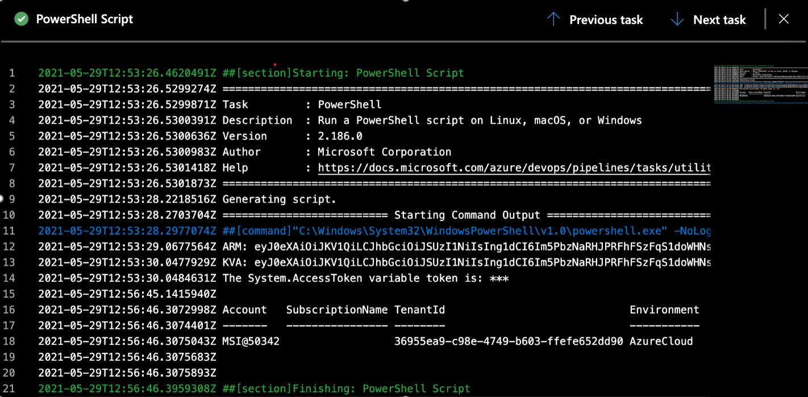
    
### Using service connections outside of intended pipeline

RBAC design and implementation of ADO can be complex because of various level of roles, permissions and scopes. Therefore, it’s needed to prevent misconfiguration or weakness in posture management to prevent the following risks:

- Unmanaged lifecycle of “Personal Access Tokens” (PAT) or uncontrolled creation and theft by unauthorized persons
    - Generating of Personal Access Token on behalf of "Endpoint or Project Admin" to manage service connections and share them to other pipelines.
- Furthermore, the RBAC allows (by default) inheritance of permission to manage pipelines and the tasks (operations as part of the agent jobs). The following attack scenarios must be mitigated to prevent privilege escalation by takeover or manipulation of pipeline tasks:
    - Run malicious operations (on-behalf of the service connection)
    - Trusted supply chain and extensions to prevent malicious code as part of the DevOps Pipelines.

## MITRE ATT&CK Framework
MITRE ATT&CK framework is commonly used for mapping Tactics, Techniques and Procedures (TTPs) for adversary actions and emulating defenses on organizations around the world.

### Tactics, Techniques & Procedures (TTPs) of the named attack scenarios


### TTP on abusing service connections in Azure DevOps

|  Attack Scenario |    TTPs         |  Description  |
|--------------|-----------|-----------|
|  Exfiltrate credentials or access token from Azure DevOps pipelines | Steal Application Access Token - [T1528](https://attack.mitre.org/techniques/T1528/)| Adversaries can steal application access tokens as a means of acquiring credentials to access remote systems and resources. Application access tokens are used to make authorized API requests on behalf of a user or service and are commonly used as a way to access resources in cloud and container-based applications and software-as-a-service (SaaS). OAuth is one commonly implemented framework that issues tokens to users for access to systems. Adversaries who steal account API tokens in cloud and containerized environments may be able to access data and perform actions with the permissions of these accounts, which can lead to privilege escalation and further compromise of the environment. |
| Using service connections outside of intended pipeline | Account Manipulation: Additional Cloud Credentials - [T1098.001](https://attack.mitre.org/techniques/T1098/001/)| Adversaries may add adversary-controlled credentials to a cloud account to maintain persistent access to victim accounts and instances within the environment. Adversaries may add credentials for Service Principals and Applications in addition to existing legitimate credentials in Azure AD. These credentials include both x509 keys and passwords.With sufficient permissions, there are a variety of ways to add credentials including the Azure Portal, Azure command line interface, and Azure or Az PowerShell modules. |
| Using service connections outside of intended pipeline | Forge Web Credentials - [T1606](https://attack.mitre.org/techniques/T1496/)| Adversaries may forge credential materials that can be used to gain access to web applications or Internet services. Web applications and services (hosted in cloud SaaS environments or on-premise servers) often use session cookies, tokens, or other materials to authenticate and authorize user access. Adversaries may generate these credential materials in order to gain access to web resources. This differs from Steal Web Session Cookie, Steal Application Access Token, and other similar behaviors in that the credentials are new and forged by the adversary, rather than stolen or intercepted from legitimate users. The generation of web credentials often requires secret values, such as passwords, Private Keys, or other cryptographic seed values |
|||

## Detection

### DevOps Auditing

Auditing is turned on by default for all Azure DevOps Services organizations and it cannot turn off. In Azure DevOps, events get stored for 90 days and then they’re deleted. However, [export to Log Analytics is available in public preview mode](https://docs.microsoft.com/en-us/azure/devops/organizations/audit/azure-devops-auditing?view=azure-devops&tabs=preview-page) at the time of writing.

On Azure DevOps side, there isn’t detailed filtering available in audit log streaming configuration, compared to Azure AD sign-in & audit or Azure Activity logs. Also, audit schema is not aligned at the time of writing with Azure Activity Log which makes correlation more complicated. One consideration is that Azure DevOps logging is changed (new events added) in monthly basis based on the [Microsoft documentation](https://docs.microsoft.com/en-us/azure/devops/organizations/audit/azure-devops-auditing?view=azure-devops&tabs=preview-page#filter-audit-log).

- Azure Sentinel includes several built-in detection rules for Azure DevOps (export of ADO Audit stream to Log Analytics workspace to Azure Sentinel is required)
- There are useful rules included which are recommended to enable, to name a few:
    - Azure DevOps Personal Access Token (PAT) related rules
    - Azure DevOps Administrator Group Monitoring – to monitor RBAC permissions
    - Azure DevOps Audit Stream Disabled – to monitor that audit flow is active
    - Multiple rules that need more information such as allow list

    

For our attack scenario we created custom hunting rules with the following logic:

We used the Azure Sentinel Watchlist to identify Azure Global services public IP-addresses  (AzurePublicIPList). Leveraging the Azure Global services public IP-address list, we were able to create correlation when Azure DevOps pipeline is used outside Azure IP-ranges.

```powershell
let ipList = toscalar(_GetWatchlist('AzurePublicIPList')
| summarize make_list(SearchKey));
let msCalls = AzureActivity
| extend isMsAddress = true
| mv-apply IP = ipList to typeof(string) on (where ipv4_is_match(CallerIpAddress, IP)
)
| summarize make_set(OperationNameValue) by CallerIpAddress, isMsAddress, Caller, TimeGenerated;
let nonMsCalls = AzureActivity
| extend isMsAddress =false
| summarize make_set(OperationNameValue) by CallerIpAddress, isMsAddress, Caller, TimeGenerated
| join kind=leftanti msCalls on $left.CallerIpAddress == $right.CallerIpAddress;
union msCalls, nonMsCalls
```

- The query was based on good example by [Ofer Shezaf's blog post](https://techcommunity.microsoft.com/t5/azure-sentinel/approximate-partial-and-combined-lookups-in-azure-sentinel/ba-p/1393795), which was also used in a nice way with another blog by [Thijs Lecomte, Monitoring Service Principals with Watchlists in Azure Sentinel](https://thecollective.eu/blog/monitoring-service-principals-with-watchlists-in-azure-sentinel)
  
- Another example query with loose correlation can be used to detect when the token is requested with the same SPN, but the callerIP does not match the token retrieval address in servicePrincipalLogs. This works when range of query is limited to access token lifetime
    ```powershell
    AzureActivity
    | extend parsedClaims = parse_json(Claims_d)
    | extend appid = tostring(parsedClaims.appid)
    | join kind=inner AADServicePrincipalSignInLogs on $left.appid == $right.AppId
    | project TimeGenerated, TimeGenerated1, OperationNameValue, IPfromActivityLogs = CallerIpAddress, IPfromSPNLogs = IPAddress, appid, HTTPRequest, parsedClaims 
    | sort by TimeGenerated, TimeGenerated1 desc 
    ```

*Side Note: Check the article "How to deploy ‘[Azure Global Services Public IP-Addresses' as a Watchlist to Azure Sentinel](https://github.com/Azure/Azure-Sentinel/tree/master/Watchlists/Azure-Public-IPs)" to learn more*. 


## Mitigation

### Securing Azure DevOps environment

**Using ADO Security Scanner to establish and track secure (posture) configuration**

Security Posture Management of the Azure DevOps’ Organization and project settings but also assets for build and release pipelines (incl. Service connections and Agent Pools) are essential.

Microsoft’s [ADO Security Scanner](https://github.com/azsk/ADOScanner-docs) can be used to consider best practices in permissions and changing default settings to secure your Azure DevOps environment:

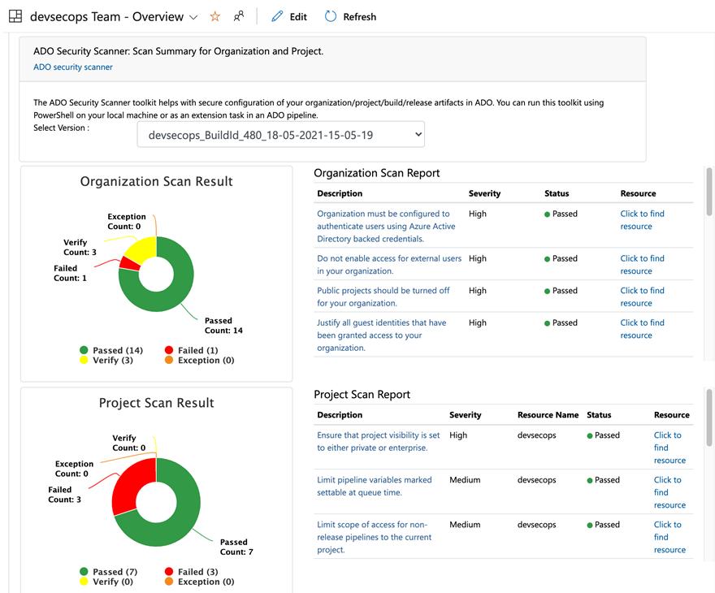

"*Scan Summary" can be integrated as dashboards in Azure DevOps. The security scans can be executed as part of an [Azure DevOps pipeline (extension)](https://github.com/azsk/ADOScanner-docs/tree/master/05-Running%20ADOScanner%20as%20pipeline%20extension), [Azure Function](https://github.com/azsk/ADOScanner-docs/tree/master/04-Running%20ADOScanner%20as%20Azure%20Function) or [PowerShell script](https://github.com/azsk/ADOScanner-docs/tree/master/02-%20Running%20ADO%20Scanner%20from%20command%20line). A list of all security controls covered by the ADO Scanner is available on the “[Secure DevOps Kit for Azure](https://azsk.azurewebsites.net/09-AzureDevOps(VSTS)-Security/ControlCoverage/README.html)” site.*

*[Export to Log Analytics Workspace and deployment as “monitoring solution”](https://github.com/azsk/ADOScanner-docs/tree/master/06-%20Tracking%20compliance%20for%20your%20ADO%20environment) allows to integrate and track the compliance in your Azure Monitor or Sentinel instance.*

### Prevention of Data Leak and Privilege Escalation

The following security policies on Organization-level should be disabled to prevent data loss or unauthorized access:

**Designing a least-privilege RBAC design**

First of all, you should consider the default role permissions and options to grant inheritance permissions in the Azure DevOps RBAC.

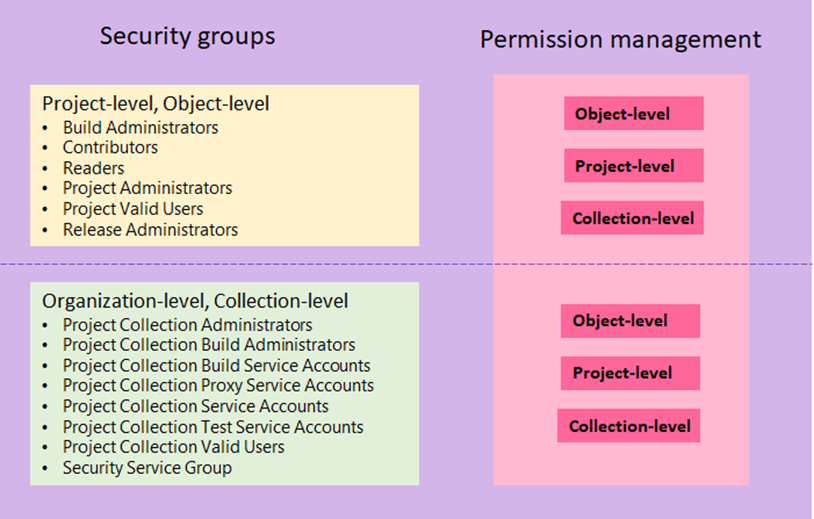

*Source: Microsoft Docs “[Get started with permissions, access levels, and security groups”](https://docs.microsoft.com/en-us/azure/devops/organizations/security/about-permissions?view=azure-devops&tabs=preview-page)*

Ensure that all organizational- and collect-level permissions are under regular review and delegated to reduced numbers of privileged users only. Members of those groups should be classified as “Management plane” administrators if service connections or agent with Contributor or Owner permission on Management Group or Subscription-Level are assigned.

In particular, protect and restrict the membership which allows to take over the entire DevOps organization (incl. all pipelines and service connections):

- Azure DevOps Owner
- Project-Collection Level Administrator
- Project Collection Service Accounts (are also member of the Project Collection Administrators)

*Note: Ownership cannot be delegated to Groups. Consider to assign permissions to a dedicated emergency / break glass account within your organization.*

*Note: Organization-level admins are able to [share service connections across projects](https://docs.microsoft.com/en-us/azure/devops/pipelines/library/service-endpoints?view=azure-devops&tabs=yaml#project-permissions---cross-project-sharing-of-service-connections).*

Restriction of default Project- and object-level permissions are necessary to prevent changes of pipelines. Consider the documented [default permissions and access.](https://docs.microsoft.com/en-us/azure/devops/organizations/security/permissions-access?view=azure-devops#azure-pipelines)

**Azure AD as single identity management plane for DevOps**

On the first look, ADO’s RBAC system seems to be very complex and independent from M365 or Azure AD (directory) roles. Nevertheless, you should implement the RBAC design alongside of best practices from your IAM in Azure AD and Azure. Microsoft Docs offers great articles how-to build an [end-to-end governance and RBAC implementation](https://docs.microsoft.com/en-us/azure/cloud-adoption-framework/secure/best-practices/end-to-end-governance) with Azure AD, Azure and Azure DevOps.

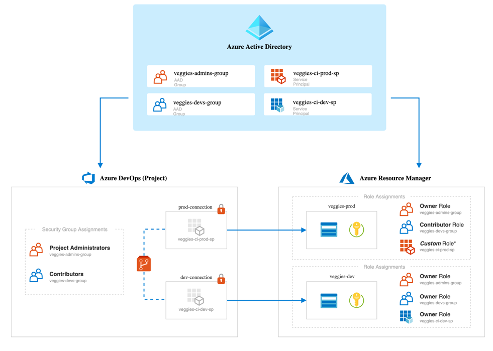

**Privileged Access Groups and Identity Governance**

Azure DevOps uses security groups from the connected "Azure Active Directory" Tenant.
Therefore, it’s possible to use Identity Governance features such as “Access Review” or “Access Packages” to manage and govern the Access Management.

Role-assignable Groups and Privileged Access Groups (PAG) can be used to protect critical security groups from modification and privileged escalation by other Azure AD Roles (such as Group or Intune Administrators). More details are described in the blog post “[Manage privileged access outside of Azure AD admin roles with Azure PIM](https://www.cloud-architekt.net/azurepim-pag-rbac/)”.

**Default permissions and potential risks on service connections**

Microsoft started to change the UI and moved to a RBAC model to delegate permissions on service connections. Because of backward compatibility, Endpoint Administrators as “Admin” and Endpoint Creators as “Creator” are still assigned per default. Therefore, consider who is member of those groups.
Keep in mind, that members of “Endpoint Administrators” are able to modify service connections to share them for other pipelines within the same project.

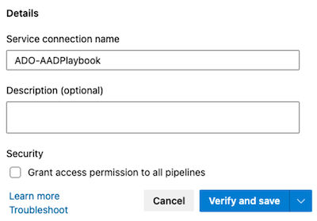

By default, members of "Contributor" Group are able to use shared service connection when authoring (new or existing) build or release pipelines or authorize yaml pipelines.

**Protecting Azure DevOps as privileged interface**

Azure DevOps should be protected similar to the “Azure Portal” or any other privileged interface or Cloud App. Enforcement of strong authentication or requirement of compliant devices could be one of configured Conditional Access Policies which are assigned to “Azure DevOps” as Cloud App.

Conditional Access Policy validation can be enforced for every web login (VS/VSCode IDE prompts) as well as alternate authentication (PATs, OAuth, SSH keys, etc.). Therefore, check the “[CAP Policy Validation](https://docs.microsoft.com/en-us/azure/devops/organizations/accounts/change-application-access-policies?view=azure-devops)” option and the according Microsoft Docs article:

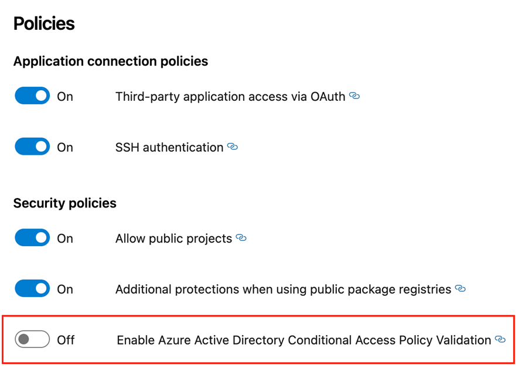

**Protection of all sources that might store secrets**

The following resources can be used to store and handle secrets. Therefore, you should consider who has access to those ones:

- Variable Groups
- Secure Files
- Environments
- Repositories
- Agent Pools

Microsoft recommends to [limit the access to those resources for specific users and specific pipelines](https://docs.microsoft.com/en-us/azure/devops/pipelines/security/resources?view=azure-devops#pipeline-permissions). Those resources and secrets should be also protected by [automated or manual approval checks every time a pipeline](https://docs.microsoft.com/en-us/azure/devops/pipelines/security/resources?view=azure-devops#checks).

Service Connections (or endpoints) was one of the focus in our playbook and will be described in details later.

## Azure Pipeline Security

Microsoft has released as part of the “Cloud Adoption Framework” (CAF) also some best practices and recommendation around [securing Azure DevOps pipelines](https://docs.microsoft.com/en-us/azure/cloud-adoption-framework/secure/best-practices/secure-devops).


One general approach to secure the pipeline process covers the implementation of approval workflows and checks for pull requests to branches that triggers pipeline.

**Branch Policies**

Executed tasks, scripts or pipeline definitions (YAML) should be protected to avoid manipulation or injection of malicious code. [Protected branches by policies](https://docs.microsoft.com/en-us/azure/devops/repos/git/branch-policies?view=azure-devops) help to prevent attackers to creating another branch in the repo and merge their code as pull request without approval or checks.

**Increasing security by using "security trough templates” approach**

Alongside of checks to protect pipeline resources, you are able to increase pipeline security by offering “[pipeline templates](https://docs.microsoft.com/en-us/azure/devops/pipelines/security/templates?view=azure-devops)”. This allows to [enforce security features](https://docs.microsoft.com/en-us/azure/devops/pipelines/security/templates?view=azure-devops#agent-logging-command-restrictions) such as agent logging or prevention of token exfiltration.

## Service Connections

**Scope of service connections**

Restrict the privilege scope to Resource Groups and consider to use least permissions to ensure fine-grained delegation to deploy resources in Azure.

**Fine-grained control of service connections**

Microsoft recommends to block inherited permissions on service connections (as you can see in the ADO scanner results). Fine-grained control of the service connections should ensure least privilege to a limited number of users or automation accounts.


*ADO Security Scanner covers also security status of service connections which includes best practices and recommendations.*

### Tracking of Service Connections and Enrichment of Security Informations from ADO API

Azure DevOps API gives you detailed information about assets and configurations which can be used for enrichment of the existing audit logs. In the following samples, an owned-developed [PowerShell Module ("ADOPipelinesSecInfo")](https://github.com/Cloud-Architekt/ADOPipelinesSecInfo) was used to get the information from the API.

The cmdlets can be executed as part of a pipeline (hosted in the same high-protected and -privileged project as "ADO Security Scanner" and other ADO orchestration tasks within the organization):

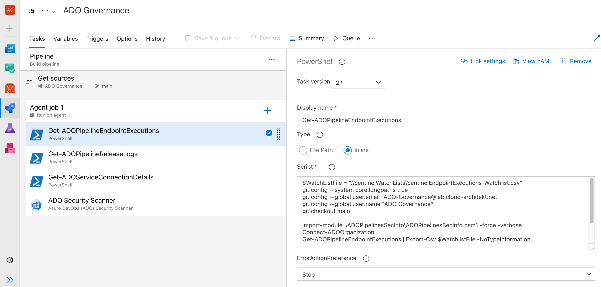

This gives you the opportunity to use the "Build Service Account" of this project for authorization instead of using the Personal Access Token (PAT) of a user account.

Furthermore, the Git repository can be used to store the WatchList incl. history and advanced workflows.

_Side Note: You need to run "Connect-ADOOrganization" to get an authorization token to the ADO API by using PAT (User Name and Token must be provided as parameter) or accessing the OAuth token of the pipeline._

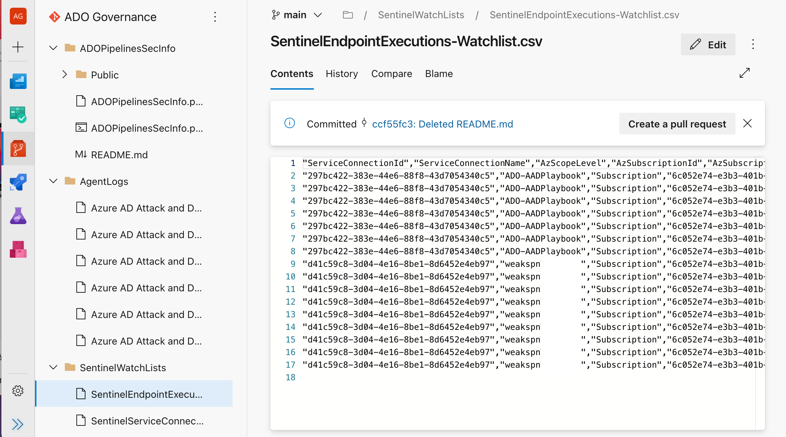

**Sample 1: Assessment of assigned and configured service connections**

Information from the API allows you to track and collect information of all service connections and the service principals which will be used for authentication to privileged endpoints (such as Azure Resource Manager):

The following script allows to store a CSV file with information about the service connections for enrichment or import as "WatchList" in Azure Sentinel:

```powershell
$WatchListFile = ".\SentinelServiceConnection-Watchlist.csv"
Connect-ADOOrganization
Get-ADOServiceConnectionDetails | Export-Csv $WatchlistFile -NoTypeInformation
```

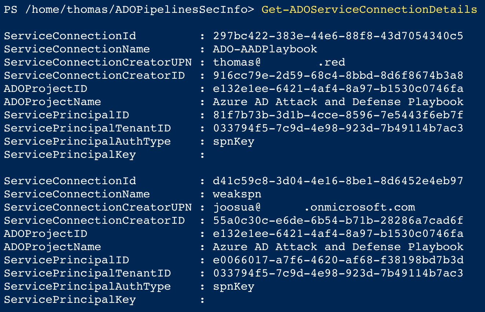

**Sample 2: Collecting agent logs from Microsoft Hosted Agents to review activities**

Agent logs from Microsoft Hosted Agents can be downloaded via ADO API as well.
The following cmdlet from the PowerShell module allows to download them in a ZIP file:

```powershell
Connect-ADOOrganization
Get-ADOPipelineReleaseLogs -ExportFolder "./AgentLogs/Releases"
```

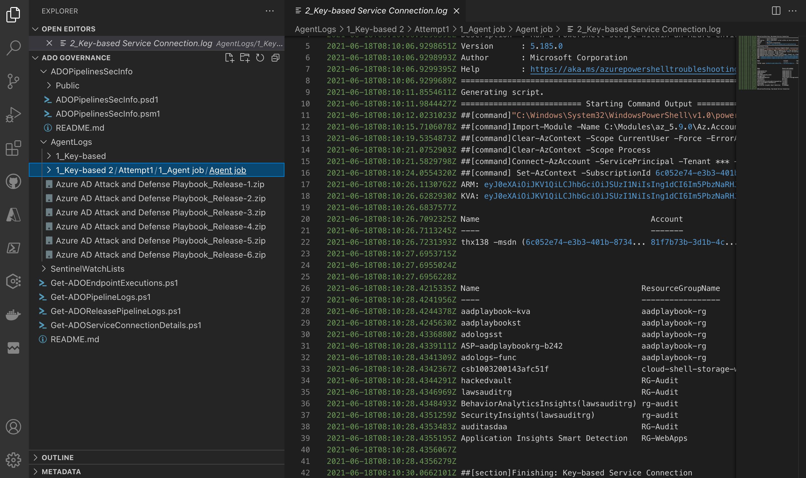

**Sample 3: Review of usage history and assignments to pipelines**

Execution history and the usage of service connections in pipeline can be also exported via ADO API. This cmdlet exports detailed information about the execution, including pipeline and process name and the relation to service principal and subscription. Informations will be stored as CSV in the "ADO Compliance" Git repository which runs and stores the ADO security scans:

```powershell

$WatchListFile = ".\ADOServiceConnectionsExecution.csv"
git config --system core.longpaths true
git config --global user.email "ADO-Governance@lab.cloud-architekt.net"
git config --global user.name "ADO Governance"
git checkout main

import-module .\ADOPipelinesSecInfo\ADOPipelinesSecInfo.psm1 -Force
Connect-ADOOrganization
Get-ADOPipelineEndpointExecutions | Export-Csv $WatchListFile -NoTypeInformation

git add -u
git add -A
git commit -m "WatchList Updated"
git push origin
```

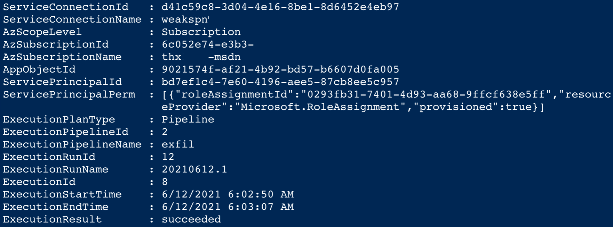

## Service Principal Security

**Process and lifecycle management for service principals**

Automated [lifecycle processes](https://docs.microsoft.com/en-us/azure/active-directory/fundamentals/service-accounts-governing-azure#build-a-lifecycle-process) and [governance](https://docs.microsoft.com/en-us/azure/active-directory/fundamentals/service-accounts-governing-azure#plan-your-service-account) are one of the keys to implement secured service principals. Tagging and classification of Service Principal (relationship to service and assigned privileged Access) and Owner management should be essential.

*Note: Currently, owner of service principal cannot be assigned to an Azure AD group.*

Storing that information into an inventory and configuration management enables you also to build correlation lists or running automated off-boarding processes.

*Note: Documentation of Service Principal is recommended because of missing restore options.*

Example of Service Principal Lifecycle for Azure Landing Zones

1. Creation and RBAC Assignment of Service Principal (Template [„Enterprise-Scale Landing Zone](https://github.com/Azure/Enterprise-Scale/blob/main/docs/EnterpriseScale-Deploy-landing-zones.md)“)

    *Note: Service Principal can’t be created by using Azure Resource Manager (ARM) API.*

2. Use certificate credentials instead of password for Devops Service Connections.

    You can implement a script, that deletes the local private key, as part of uploading the combined key file to Azure Devops. After that the credentials are essentially only compromizable from Azure Devops, and can't be shared, are not submitted on each request to token endpoint like password credentials are. 
    
    Also from perspective of rotation, the private key is never shared after this, as it's only used to sign the outbound request to Azure AD (whereas the password credential is exposed in each HTTPS request to Azure AD) 
    
    [Reference from AZSK ADO](https://azsk.azurewebsites.net/09-AzureDevOps(VSTS)-Security/ControlCoverage/README.html#service-connection)
    

    **Reference from SecureCloud.blog and github**
    - https://securecloud.blog/2021/04/13/azure-devops-use-certificate-for-azure-service-connection-spn/)
    - https://github.com/jsa2/aadClientCredentialsDoc
 

    **Reference from MS Identity Platform best practices**
    
    [Reference](https://docs.microsoft.com/en-us/azure/active-directory/develop/identity-platform-integration-checklist#security)

    

3. Creation of Azure DevOps service connection via API using PowerShell

    _Check the script and blog post by [Barbara Forbes](https://4bes.nl/2020/12/20/create-an-azure-devops-service-connection-to-azure-with-powershell/)_

4. If you must use password based credential, Implement automatic key rotation on Azure DevOps service connections

    _[Koos Goossens](https://medium.com/wortell/implement-automatic-key-rotation-on-azure-devops-service-connections-13804b92157c) has written a great blog and script how to implement a rotation process._

5. Monitoring Service Principals with Watchlists in Azure Sentinel

    _Thijs Lecomte has given great insights in his [detailed blog post](https://thecollective.eu/blog/monitoring-service-principals-with-watchlists-in-azure-sentinel/)._

**Securing and restricting access of Service Principals**

According to [Azure Feedback](https://feedback.azure.com/forums/169401-azure-active-directory/suggestions/37867180-restricting-access-of-azure-service-principals-u), Microsoft is working on a “policy-driven” solution to restrict access based on IP range.

Service Principals aren’t protected (compared to user object) if they are member of privileged Azure AD roles or role-assignable group. Therefore, you should consider owner and delegated permissions to manage high-privileged service principals to avoid privilege escalation.

Use “access review” in Identity Governance and Azure PIM to have a regular review on the assigned permission. This works for [Azure AD](https://docs.microsoft.com/en-us/azure/active-directory/privileged-identity-management/pim-how-to-start-security-review) and [Azure RBAC roles](https://docs.microsoft.com/en-us/azure/active-directory/privileged-identity-management/pim-resource-roles-start-access-review).

[Introduction to securing Azure Active Directory service accounts | Microsoft Docs](https://docs.microsoft.com/en-us/azure/active-directory/fundamentals/service-accounts-introduction-azure)

**Alternate: Using Managed Identities (System-assigned)**

System-assigned "Managed identities" are strongly recommended and including an automated lifecycle and “bounded” to Azure service instance.

Microsoft recommends ([as part of the design recommendations of a landing zone](https://docs.microsoft.com/en-us/azure/cloud-adoption-framework/ready/enterprise-scale/identity-and-access-management#plan-for-authentication-inside-a-landing-zone)) to use Managed Identities (instead of Service Prinicpals) to reduce exposure to credential theft.

On the other hand, it requires to run pipelines on self-hosted agents.
Learn more about managed identities in Azure DevOps in [Stefan Stranger’s blog post](https://stefanstranger.github.io/2019/03/02/ManageIdentityInServiceConnections/).

Keep in mind, security of self-hosted agents needs to be managed by the customer. The implementation of secured and isolated VMs are also part of the responsibility. 

# References

How credentials are stored in Azure DevOps

- [How we store your credentials - Azure DevOps Services | Microsoft Docs](https://docs.microsoft.com/en-us/azure/devops/organizations/security/credential-storage?view=azure-devops)

Guidance for authentication

- [Guidance for authentication - Azure DevOps | Microsoft Docs](https://docs.microsoft.com/en-us/azure/devops/integrate/get-started/authentication/authentication-guidance?view=azure-devops)

General security recommendations from CAF

- [End-to-end governance from DevOps to Azure](https://docs.microsoft.com/en-us/azure/cloud-adoption-framework/secure/best-practices/end-to-end-governance)
- [Secure the pipeline and CI/CD workflow](https://docs.microsoft.com/en-us/azure/cloud-adoption-framework/secure/best-practices/secure-devops)

Microsoft Docs related to pipeline security:

- Azure DevOps Pipeline Security:[Securing Azure Pipelines - Azure Pipelines | Microsoft Docs](https://docs.microsoft.com/en-us/azure/devops/pipelines/security/overview?view=azure-devops)
- Secure the pipeline and CI/CD workflow[Secure DevOps - Cloud Adoption Framework | Microsoft Docs](https://docs.microsoft.com/en-us/azure/cloud-adoption-framework/secure/best-practices/secure-devops)
- Secure Azure pipelines:[About pipeline security roles - Azure DevOps | Microsoft Docs](https://docs.microsoft.com/en-us/azure/devops/organizations/security/about-security-roles?view=azure-devops)
